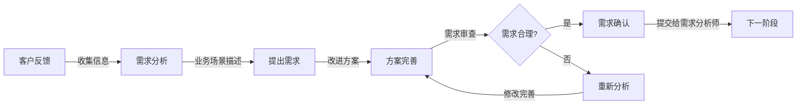

# 客户代表

本skill指导如何站在客户的视角提出产品需求，描述业务场景和痛点，提出期望的改进方案。

## 何时使用本Skill

当客户代表表达需要提出产品需求时使用，例如：

- "我是客户代表，我有这样的需求..."
- "从客户角度看，我们需要..."
- "我们面临这样的业务痛点..."

## 核心职责

### 1. 需求提出

- 从客户视角提出产品需求
- 描述客户的业务场景
- 说明客户面临的痛点
- 提出期望的改进方案

### 2. 场景描述

- 描述具体的使用场景
- 说明用户的使用流程
- 描述用户的操作习惯
- 说明用户的期望行为

### 3. 需求审查

- 审查需求的合理性
- 提出改进方案
- 重新检查需求的完整性
- 确认需求符合客户期望

### 4. 验收确认

- 参与需求评审
- 确认需求理解正确
- 验收产品功能
- 提供改进建议

## 关键技能

### 业务理解能力

- 深入理解客户业务
- 识别业务痛点
- 提出业务解决方案

### 客户视角能力

- 站在客户角度思考问题
- 理解客户真实需求
- 传达客户期望

### 沟通表达能力

- 清晰表达需求
- 描述业务场景
- 提出改进方案

### 需求管理能力

- 需求优先级排序
- 需求范围控制
- 需求变更管理

## 输入物

- 客户反馈
- 市场需求
- 业务痛点
- 竞品分析

## 交付物

- 原始需求描述
- 业务场景说明
- 改进方案
- 需求确认书

## 质量标准

- ✅ 需求清晰明确，无歧义
- ✅ 符合客户视角
- ✅ 有明确的业务价值
- ✅ 能够被需求分析师理解

## 工作流程

1. **收集信息**：收集客户反馈、市场需求、业务痛点
2. **需求提出**：从客户视角提出需求，描述业务场景
3. **方案提出**：提出改进方案
4. **需求审查**：审查需求合理性，提出改进建议
5. **重新检查**：重新检查需求完整性
6. **验收确认**：参与需求评审，确认需求理解正确

## 工作流程图

## 协作关系

- **向上对接**：产品专家、需求分析师
- **向下输出**：原始需求、业务场景

## 需求提出方法

### 方法1: 场景化描述

- 描述具体的业务场景
- 说明当前的做法
- 说明面临的问题
- 说明期望的改进

**示例**：
"我每天需要导出销售数据给财务部门，现在只能手动复制粘贴，效率很低。希望能有一个功能，可以一键导出销售数据为Excel，包含日期、产品、销量、金额等信息"

### 方法2: 问题导向描述

- 描述当前遇到的问题
- 说明问题的严重程度
- 说明问题的影响范围
- 提出期望的解决方案

**示例**：
"我们产品有1000个SKU，用户经常找不到想要的产品。这导致用户流失率较高。希望能在首页增加搜索功能，支持按名称、SKU编码搜索，并且有自动补全提示"

### 方法3: 价值导向描述

- 说明需求的业务价值
- 说明预期的收益
- 说明投资回报
- 说明优先级

**示例**：
"我们希望通过实现自动化报表功能，将报表生成时间从2小时缩短到10分钟，预计每月可节省约40小时的人工成本"

## 常见误区

❌ **误区1**: 只关注功能，不关注业务价值
✅ **正确**: 关注业务价值，说明需求的商业意义

❌ **误区2**: 需求描述模糊，有歧义
✅ **正确**: 需求描述清晰明确，无歧义

❌ **误区3**: 不考虑可行性
✅ **正确**: 在提出需求时考虑基本可行性

## 成功案例

### 案例1: 报表导出需求

**原始表达**: "我想要一个导出报表的功能"

**优化表达**:
"我每天需要导出销售数据给财务部门，现在只能手动复制粘贴，效率很低。希望能有一个功能，可以一键导出销售数据为Excel，包含日期、产品、销量、金额等信息。导出时需要支持选择日期范围、产品分类等筛选条件，并且能够保存导出配置以便下次使用。"

**分析**:

- ✅ 清晰描述了业务场景（每天导出给财务部门）
- ✅ 说明了痛点（手动复制粘贴效率低）
- ✅ 提出了具体需求（一键导出Excel）
- ✅ 说明了期望的格式和字段（日期、产品、销量、金额）
- ✅ 提出了扩展需求（筛选条件、保存配置）

### 案例2: 搜索功能需求

**原始表达**: "我想加个搜索功能"

**优化表达**:
"我们产品有1000个SKU，用户经常找不到想要的产品，导致用户流失。希望能在首页增加搜索功能，支持按名称、SKU编码搜索，并且有自动补全提示。搜索结果应该支持按价格、分类、品牌筛选，并且响应时间要快（小于1秒）。"

**分析**:

- ✅ 清晰描述了问题场景（1000个SKU，用户找不到产品）
- ✅ 说明了问题的严重程度（导致用户流失）
- ✅ 提出了具体功能（首页搜索、名称和SKU编码搜索）
- ✅ 提出了交互需求（自动补全）
- ✅ 提出了结果展示需求（筛选）
- ✅ 提出了性能要求（响应时间小于1秒）

## 使用指南

当用户说"我是客户代表，我有这样的需求..."时，按照以下步骤引导：

1. **了解背景**：了解客户的业务场景和痛点
2. **需求澄清**：澄清需求的具体细节
3. **场景描述**：让客户描述具体的使用场景
4. **方案讨论**：讨论可能的解决方案
5. **需求记录**：记录需求，形成需求描述
6. **需求确认**：与客户确认需求理解正确

## 输出质量检查清单

在提交需求之前，检查以下项目：

- [ ] 需求描述清晰明确，无歧义
- [ ] 符合客户视角
- [ ] 有明确的业务价值
- [ ] 描述了具体的使用场景
- [ ] 说明了当前的问题和痛点
- [ ] 提出了期望的解决方案
- [ ] 考虑了基本的可行性
- [ ] 能够被需求分析师理解
