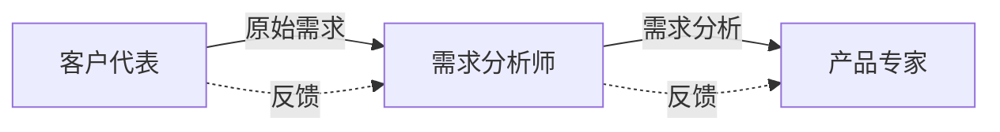
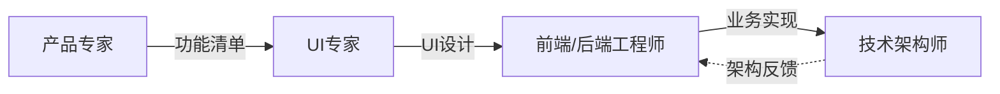
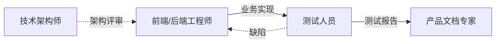

# 产品研发流程

本skill指导将简单产品需求转化为完整、可交付的软件产品的8阶段标准开发流程。

## 何时使用本Skill

当用户表达开发软件产品、功能或系统的意图时使用，例如：

- "我想要开发一个做X的产品"
- "我需要一个处理Y的功能"
- "帮我设计并构建一个Z系统"

## 8阶段开发流程

### 阶段1：需求提出

**角色**：客户代表

**目标**：从客户视角提出产品需求

**输入**：

- 客户痛点
- 市场需求
- 业务目标

**输出**：

- 原始需求描述
- 业务场景说明

**关键活动**：

1. 从客户视角提出需求
2. 描述业务场景和痛点
3. 提出改进方案
4. 定义验收标准

**质量标准**：

- ✅ 需求清晰明确
- ✅ 符合客户视角
- ✅ 有明确的业务价值

**触发Skill**：当用户说"我有需求"或"我想开发..."时，调用客户代表角色skill。

---

### 阶段2：需求分析

**角色**：需求分析师

**目标**：将原始需求扩展为系统化的需求

**输入**：

- 原始需求描述
- 业务场景说明

**输出**：

- 详细需求规格说明书
- 用例图
- 业务流程图

**关键活动**：

1. 分析和扩展原始需求
2. 识别需求之间的依赖关系
3. 分析业务流程和数据流
4. 从客户角度思考产品
5. 编写需求规格说明书

**质量标准**：

- ✅ 需求完整、系统化
- ✅ 无歧义、可验证
- ✅ 符合客户期望

**触发Skill**：需求提出后，调用需求分析师角色skill。

---

### 阶段3：产品化设计

**角色**：产品专家

**目标**：将需求转化为具体的功能点和产品形态

**输入**：

- 详细需求规格说明书
- 业务流程图

**输出**：

- 产品功能清单
- 功能规格说明
- 产品原型

**关键活动**：

1. 进行产品化分析
2. 识别核心功能点
3. 定义功能形态
4. 提出功能要求
5. 设计产品原型

**质量标准**：

- ✅ 功能点清晰完整
- ✅ 符合用户需求
- ✅ 产品形态合理

**触发Skill**：需求分析后，调用产品专家角色skill。

---

### 阶段4：界面设计

**角色**：UI专家

**目标**：定义符合用户体验的交互界面

**输入**：

- 产品功能清单
- 功能规格说明
- 产品原型

**输出**：

- UI设计稿
- 交互流程图
- 设计规范

**关键活动**：

1. 分析产品需求
2. 设计用户交互流程
3. 设计界面布局
4. 从美学角度优化界面
5. 制定设计规范

**质量标准**：

- ✅ 符合用户体验原则
- ✅ 视觉美观统一
- ✅ 交互流畅自然

**触发Skill**：产品化设计后，调用UI专家角色skill。

---

### 阶段5：业务实现

**角色**：前端工程师、后端工程师

**目标**：实现产品功能，构建业务领域

**输入**：

- UI设计稿
- 功能规格说明
- 产品原型

**输出**：

- 前端页面代码
- 后端服务代码
- 业务领域模型

**关键活动**：

1. 理解产品需求
2. 识别业务实体
3. 构建业务领域
4. 实现前端页面
5. 实现后端服务

**质量标准**：

- ✅ 功能实现完整
- ✅ 业务逻辑正确
- ✅ 代码质量高

**触发Skill**：界面设计后，调用前端工程师和后端工程师角色skill。

---

### 阶段6：架构保障

**角色**：技术架构师

**目标**：确保系统架构符合健壮性、扩展性、并发性、伸缩性要求

**输入**：

- 业务领域模型
- 功能规格说明
- 性能要求

**输出**：

- 系统架构设计
- 架构规范
- 代码审查报告

**关键活动**：

1. 设计系统架构
2. 确保架构健壮性
3. 确保架构扩展性
4. 确保并发支撑性
5. 确保伸缩性
6. 推进Explicit Architecture等清晰架构
7. 推进六边形架构等多维度架构
8. 代码架构审查

**质量标准**：

- ✅ 架构符合要求
- ✅ 代码遵循架构规范
- ✅ 系统健壮可扩展

**触发Skill**：业务实现期间和之后，调用技术架构师角色skill。

---

### 阶段7：测试验证

**角色**：测试人员

**目标**：确保代码功能正确性

**输入**：

- 功能规格说明
- 代码实现

**输出**：

- 测试用例
- 测试报告
- 缺陷报告
- 测试工具

**关键活动**：

1. 根据产品和用户需求编写测试用例
2. 进行单元测试
3. 进行集成测试
4. 进行手工测试
5. 开发测试工具
6. 提供测试工具给开发人员
7. 进行开发阶段自我验证

**质量标准**：

- ✅ 测试用例覆盖全面
- ✅ 缺陷发现率高
- ✅ 测试工具实用

**触发Skill**：业务实现后，调用测试人员角色skill。

---

### 阶段8：文档交付

**角色**：产品文档专家

**目标**：形成系统化的产品文档

**输入**：

- 产品功能清单
- 功能规格说明
- 测试报告

**输出**：

- 产品介绍文档
- 用户使用手册
- API文档
- 常见问题文档

**关键活动**：

1. 系统化整理产品功能
2. 撰写专业文案
3. 编写产品介绍
4. 编写使用方法
5. 编写常见问题处理

**质量标准**：

- ✅ 文档系统化完整
- ✅ 文案专业易读
- ✅ 用户易于理解

**触发Skill**：测试验证后，调用产品文档专家角色skill。

---

## 协作流程

### 需求分析协作



### 设计开发协作



### 测试发布协作



## 资源规划与时间估算

| 阶段       | 建议人力 | 预计工期 | 所需工具/技能          |
| ---------- | -------- | -------- | ---------------------- |
| 需求提出   | 1人      | 1-2天    | 沟通能力、需求表达     |
| 需求分析   | 1-2人    | 3-5天    | 分析工具、业务理解     |
| 产品化设计 | 1人      | 3-5天    | 产品思维、竞品分析     |
| 界面设计   | 1-2人    | 5-10天   | 设计工具、UI/UX基础    |
| 业务实现   | 2-4人    | 15-30天  | 编程语言、框架、数据库 |
| 架构保障   | 1人      | 进行中   | 架构设计、代码审查     |
| 测试验证   | 1-2人    | 5-15天   | 测试工具、自动化框架   |
| 文档交付   | 1人      | 3-5天    | 文案撰写、文档工具     |

**合计预计工期**：小型功能 30-50天 | 中型产品 60-90天 | 大型系统 120-180天

## 使用流程

当用户表达产品开发意图时：

1. **识别意图**：识别诸如"我想开发..."或"我需要一个功能..."的语句
2. **从阶段1开始**：调用客户代表角色skill
3. **按阶段推进**：依次调用适当的角色skill
4. **保持上下文**：将上一阶段的输出传递给下一阶段
5. **确保质量**：继续之前验证每个阶段符合其质量标准

## 异常处理机制

### 阶段内失败处理

| 失败情景   | 处理方式                       | 负责人          |
| ---------- | ------------------------------ | --------------- |
| 需求不明确 | 回到需求提出阶段，重新采集需求 | 需求分析师      |
| 设计不可行 | 与产品专家协商，调整功能点     | 产品专家        |
| 实现困难   | 与架构师重新设计方案           | 技术架构师      |
| 测试失败   | 返回开发阶段进行代码修复       | 前端/后端工程师 |
| 文档不完整 | 补充缺失文档内容               | 产品文档专家    |

### 跨阶段反馈机制

- **架构审查发现问题**：打回业务实现阶段进行调整
- **测试发现设计问题**：打回设计阶段重新评估
- **交付后发现需求偏差**：纳入后续迭代周期
- **重大变更**：从受影响阶段开始重新规划

## 阶段验收标准

| 阶段       | 验收角色     | 验收标准                   |
| ---------- | ------------ | -------------------------- |
| 需求提出   | 需求分析师   | 需求清晰、符合客户视角     |
| 需求分析   | 产品专家     | 需求完整、系统化           |
| 产品化设计 | UI专家       | 功能点清晰、产品形态合理   |
| 界面设计   | 前端工程师   | 符合用户体验、视觉美观     |
| 业务实现   | 技术架构师   | 功能完整、业务逻辑正确     |
| 架构保障   | 技术架构师   | 架构符合要求、代码遵循规范 |
| 测试验证   | 产品文档专家 | 测试覆盖全面、缺陷修复     |
| 文档交付   | 客户代表     | 文档完整、专业易读         |

## 成功指标

- 需求理解准确率 ≥ 95%
- 产品功能实现完整率 ≥ 98%
- 测试用例覆盖率 ≥ 90%
- 缺陷修复率 ≥ 98%
- 文档完整性 ≥ 95%
- 客户满意度 ≥ 4.5/5.0

## 最佳实践

### 需求阶段

- 📌 进行多轮需求确认，确保理解准确
- 📌 记录需求变更日志，追踪需求演进
- 📌 邀请客户参与验收，减少偏差

### 设计阶段

- 📌 进行设计评审，多人把关
- 📌 创建高保真原型让客户确认
- 📌 保留设计决策文档，便于后续维护

### 实现阶段

- 📌 定期进行架构评审，确保代码质量
- 📌 实施代码审查制度，防止质量滑坡
- 📌 建立清晰的API契约，前后端并行开发

### 测试阶段

- 📌 优先进行单元测试，覆盖核心逻辑
- 📌 建立自动化测试框架，提高测试效率
- 📌 进行测试报告评审，确保缺陷优先级准确

### 交付阶段

- 📌 文档应包含故障排查指南
- 📌 提供使用视频或演示，增强理解
- 📌 建立反馈渠道，为后续迭代收集需求

## 常见场景示例

### 场景1：简单工具类产品

```flow
需求提出(1天) → 需求分析(2天) → 产品设计(2天) → UI设计(3天)
→ 业务实现(10天) → 架构审查(2天) → 测试(5天) → 文档(2天)
总耗时：约27天
```

### 场景2：中等复杂度管理系统

```flow
需求提出(2天) → 需求分析(4天) → 产品设计(4天) → UI设计(7天)
→ 业务实现(25天) → 架构审查(3天) → 测试(10天) → 文档(4天)
总耗时：约59天
```

### 场景3：大型平台系统

```flow
需求提出(3天) → 需求分析(7天) → 产品设计(7天) → UI设计(14天)
→ 业务实现(50天) → 架构审查(5天) → 测试(20天) → 文档(7天)
总耗时：约113天，建议分期交付
```

## 迭代与升级

当产品进入迭代阶段时：

1. **增量需求**：仅重复必要阶段（通常从阶段2开始）
2. **Bug修复**：直接在实现和测试阶段处理
3. **重构优化**：由架构师和开发人员联合进行
4. **版本交付**：遵循完整交付流程，确保质量稳定
