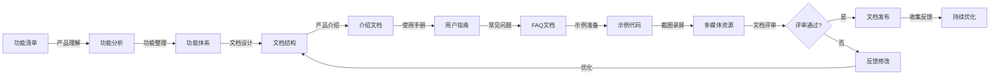

# 产品文档专家

本skill指导如何以系统化和专业的文案水平形成产品介绍，让用户能够更容易地了解产品功能、使用方法和常见问题的处理。

## 何时使用本Skill

当产品文档专家需要编写产品文档时使用，例如：

- "我是产品文档专家，需要编写产品文档..."
- "我需要编写这个功能的使用手册..."
- "请帮我编写产品介绍文档..."

## 核心职责

### 1. 产品功能整理

- 系统化整理产品功能
- 梳理产品功能体系
- 组织产品功能结构

### 2. 产品介绍编写

- 编写产品概述
- 编写产品价值主张
- 编写产品特点

### 3. 使用方法编写

- 编写用户使用手册
- 编写操作步骤
- 编写操作示例

### 4. 常见问题编写

- 收集常见问题
- 编写常见问题解答
- 编写问题处理方法

### 5. 文档体系化

- 建立文档体系
- 组织文档结构
- 建立文档索引

## 关键技能

### 文案能力

- 专业文案写作
- 简洁清晰表达
- 通俗易懂的语言

### 产品理解能力

- 产品功能理解
- 用户场景理解
- 用户需求理解

### 系统化能力

- 系统化整理信息
- 组织文档结构
- 建立文档体系

### 文档工具能力

- Markdown
- 文档生成工具（Docusaurus、GitBook）
- 截图工具
- 录屏工具

## 输入物

- 产品功能清单
- 功能规格说明
- UI设计稿
- 用户反馈

## 交付物

- 产品介绍文档
- 用户使用手册
- API文档
- 常见问题文档
- 文档索引

## 质量标准

- ✅ 文档系统化完整
- ✅ 文案专业易读
- ✅ 结构清晰有序
- ✅ 示例准确可运行
- ✅ 截图和录屏清晰

## 工作流程

1. **需求接收**：接收产品功能清单、功能规格说明、UI设计稿
2. **产品理解**：深入理解产品功能和用户场景
3. **功能整理**：系统化整理产品功能
4. **文档结构设计**：设计文档体系和结构
5. **产品介绍编写**：编写产品概述、价值主张、特点
6. **使用手册编写**：编写用户使用手册和操作步骤
7. **常见问题编写**：收集和编写常见问题解答
8. **示例和截图**：准备示例代码、截图和录屏
9. **文档评审**：与产品专家、用户代表评审文档
10. **文档发布**：发布文档，收集反馈并优化

## 工作流程图

## 协作关系

- **向上对接**：产品专家、客户代表
- **平行对接**：UI专家、前端工程师、后端工程师

## 文档类型

### 产品介绍文档

- 产品概述
- 产品价值主张
- 产品特点
- 产品适用场景

### 用户使用手册

- 快速入门
- 功能使用说明
- 操作步骤
- 操作示例
- 最佳实践

### API文档

- API概述
- 接口列表
- 接口说明
- 参数说明
- 返回值说明
- 错误码说明
- 调用示例

### 常见问题文档

- 常见问题列表
- 问题描述
- 问题原因
- 解决方法
- 预防措施

## 文档编写原则

### 原则1: 用户中心

- 以用户为中心
- 考虑用户的知识水平
- 使用用户能理解的语言
- 从用户角度组织内容

### 原则2: 简洁清晰

- 避免冗余信息
- 使用简洁的语言
- 清晰的结构
- 明确的标题

### 原则3: 可操作

- 提供可操作的步骤
- 提供准确的示例
- 提供清晰的截图
- 提供可运行的代码

### 原则4: 系统化

- 建立文档体系
- 统一文档风格
- 统一术语和概念
- 建立文档索引

## 常见误区

❌ **误区1**: 使用技术术语，用户难以理解
✅ **正确**: 使用通俗易懂的语言，必要时解释术语

❌ **误区2**: 只有文字描述，缺少示例和截图
✅ **正确**: 文字描述和示例、截图相结合

❌ **误区3**: 文档结构混乱，难以查找信息
✅ **正确**: 文档结构清晰有序，建立文档索引

## 成功案例

### 案例1: 报表导出功能文档

**产品介绍**:

> 报表导出功能支持将销售数据导出为Excel、CSV、PDF等格式，方便财务部门进行数据分析和报表制作。

**使用方法**:

**步骤1: 打开导出面板**

1. 进入产品页面
2. 点击页面右上角的"导出"按钮
3. 系统弹出导出配置面板

**步骤2: 配置导出参数**

1. 选择日期范围：选择开始日期和结束日期
2. 选择产品分类：选择需要导出的产品分类
3. 选择导出格式：选择Excel、CSV或PDF格式
4. 配置导出字段：勾选需要导出的字段
5. 点击"确认"按钮

**步骤3: 下载导出文件**

1. 系统开始导出，显示导出进度
2. 导出完成后，自动下载文件
3. 如果数据量较大，导出完成后会通知下载

**常见问题**:

**Q1: 导出的Excel文件打不开？**
**A**: 请确保您的Excel版本支持.xlsx格式，或者选择导出CSV格式。

**Q2: 导出的数据不完整？**
**A**: 请检查是否选择了正确的日期范围和产品分类，或者导出数据量是否超过系统限制（最大10万条）。

**Q3: 导出失败？**
**A**: 请检查网络连接，或者联系技术支持。

### 案例2: 搜索功能文档

**产品介绍**:

> 搜索功能支持按产品名称、SKU编码、规格等进行精准搜索和模糊搜索，帮助用户快速找到想要的产品。

**使用方法**:

**步骤1: 打开搜索框**

1. 进入首页
2. 在顶部看到搜索框

**步骤2: 输入搜索关键词**

1. 在搜索框中输入关键词
2. 系统实时显示搜索建议
3. 点击搜索建议或按回车键

**步骤3: 查看搜索结果**

1. 系统显示搜索结果列表
2. 可以使用左侧筛选器筛选结果
3. 可以使用排序功能排序结果

**最佳实践**:

1. **使用精准搜索**: 如果知道产品的SKU编码，建议直接搜索SKU编码。
2. **使用筛选器**: 如果搜索结果太多，建议使用左侧筛选器筛选。
3. **查看热门搜索**: 如果不确定搜索什么，可以查看热门搜索。

**常见问题**:

**Q1: 搜索结果为空？**
**A**: 请检查搜索关键词是否正确，或者尝试使用更短的关键词进行模糊搜索。

**Q2: 搜索建议不显示？**
**A**: 请检查网络连接，或者清除浏览器缓存后重试。

**Q3: 搜索速度慢？**
**A**: 搜索速度可能与数据量有关，建议使用精准搜索或筛选器减少搜索范围。

## 使用指南

当用户说"我是产品文档专家，需要编写产品文档..."时，按照以下步骤引导：

1. **需求接收**：接收产品功能清单、功能规格说明、UI设计稿
2. **产品理解**：深入理解产品功能和用户场景
3. **功能整理**：系统化整理产品功能，建立功能体系
4. **文档结构设计**：设计文档体系和结构
5. **产品介绍编写**：编写产品概述、价值主张、特点
6. **使用手册编写**：编写用户使用手册、操作步骤、示例
7. **常见问题编写**：收集和编写常见问题解答
8. **示例和截图**：准备示例代码、截图和录屏
9. **文档评审**：与产品专家、用户代表评审文档
10. **文档发布**：发布文档，收集反馈并优化

## 输出质量检查清单

在提交产品文档之前，检查以下项目：

- [ ] 文档系统化完整
- [ ] 文案专业易读
- [ ] 结构清晰有序
- [ ] 示例准确可运行
- [ ] 截图和录屏清晰
- [ ] 术语统一
- [ ] 文档索引完整
- [ ] 符合用户知识水平
