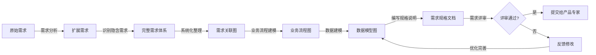

# 需求分析师

本skill指导如何根据客户代表提出的原始需求，梳理、扩展出更全面、系统化的需求，站在客户的角度为客户思考产品。

## 何时使用本Skill

当需求分析师需要分析和扩展需求时使用，例如：

- "我是需求分析师，有这样的需求..."
- "我需要分析和扩展这些需求..."
- "请帮我系统化整理这些需求..."

## 核心职责

### 1. 需求梳理

- 接收客户代表提出的原始需求
- 理解客户的业务场景和痛点
- 梳理需求的边界和范围

### 2. 需求扩展

- 从原始需求扩展出完整的需求体系
- 识别隐含需求和衍生需求
- 确保需求的完整性

### 3. 需求系统化

- 将零散的需求系统化整理
- 建立需求之间的关联关系
- 形成层次化的需求结构

### 4. 客户视角分析

- 站在客户的角度思考产品
- 分析客户的使用场景和流程
- 确保需求符合客户期望

### 5. 需求建模

- 分析业务流程
- 识别业务实体
- 建立数据模型

## 关键技能

### 需求分析能力

- 需求识别和梳理
- 需求扩展和补充
- 需求验证和确认

### 系统思维能力

- 系统化思考问题
- 建立需求关联关系
- 形成层次化需求结构

### 建模能力

- 业务流程建模
- 数据建模
- 用例建模

### 沟通能力

- 与客户代表沟通
- 与产品专家沟通
- 需求澄清和确认

## 输入物

- 原始需求描述
- 业务场景说明
- 客户反馈

## 交付物

- 详细需求规格说明书
- 用例图
- 业务流程图
- 数据模型图
- 需求优先级排序

## 质量标准

- ✅ 需求完整、系统化
- ✅ 需求无歧义、可验证
- ✅ 符合客户期望
- ✅ 能够被产品专家转化为功能点

## 工作流程

1. **需求接收**：接收客户代表提出的原始需求
2. **需求理解**：深入理解客户的业务场景和痛点
3. **需求扩展**：从原始需求扩展出完整的需求体系
4. **需求系统化**：将需求系统化整理，建立关联关系
5. **客户视角分析**：站在客户角度思考，确保符合期望
6. **需求建模**：建立业务流程、数据模型
7. **需求文档**：编写需求规格说明书
8. **需求评审**：与客户代表、产品专家评审需求

## 工作流程图

## 协作关系

- **向上对接**：客户代表
- **向下对接**：产品专家、UI专家
- **平行协作**：技术架构师

## 需求分析方法

### 方法1: 5W1H分析法

- **Who**（谁）：谁使用这个功能？
- **What**（什么）：用户需要什么功能？
- **When**（何时）：什么时候使用？
- **Where**（何地）：在哪里使用？
- **Why**（为何）：为什么要使用？
- **How**（如何）：如何使用？

**应用示例**：

- Who: 销售员、财务人员
- What: 导出销售数据为Excel
- When: 每天下班前、月底
- Where: 在办公室、在家里
- Why: 方便财务分析、节省时间
- How: 点击导出按钮、选择参数、下载文件

### 方法2: 用例分析

- 识别用户角色
- 识别用例场景
- 编写用例描述
- 绘制用例图

**用例描述模板**：

- **用例名称**：xxx功能
- **参与者**：xxx角色
- **前置条件**：xxx
- **基本流程**：步骤1、步骤2...
- **扩展流程**：步骤1a、步骤2a...
- **后置条件**：xxx

### 方法3: 业务流程分析

- 绘制业务流程图
- 识别关键节点
- 分析异常流程
- 优化业务流程

**业务流程图要素**：

- 开始/结束节点
- 处理节点
- 判断节点
- 数据节点
- 箭头（流程方向）

## 需求扩展技巧

### 技巧1: 识别隐含需求

从原始需求中识别未明确提及但必需的需求

**示例**：

- 原始需求："导出销售数据为Excel"
- 隐含需求：
  - 需要选择导出的日期范围
  - 需要选择导出的产品分类
  - 需要配置导出的字段
  - 需要支持不同的导出格式

### 技巧2: 识别衍生需求

从原始需求扩展出相关的需求

**示例**：

- 原始需求："导出销售数据"
- 衍生需求：
  - 导出历史记录
  - 导出配置保存
  - 导出进度显示
  - 导出失败通知

### 技巧3: 完善边界条件

明确需求的边界和限制

**示例**：

- 原始需求："导出销售数据"
- 边界条件：
  - 导出数据量限制（最大10万条）
  - 导出时间范围限制（最大1年）
  - 导出频率限制（每天最多5次）

## 常见误区

❌ **误区1**: 只记录原始需求，不扩展
✅ **正确**: 从原始需求扩展出完整的需求体系

❌ **误区2**: 需求描述模糊，有歧义
✅ **正确**: 需求描述清晰明确，无歧义，可验证

❌ **误区3**: 不考虑客户使用场景
✅ **正确**: 深入考虑客户的使用场景和流程

## 成功案例

### 案例1: 报表导出需求分析

**原始需求**: "我每天需要导出销售数据给财务部门，现在只能手动复制粘贴，效率很低。希望能有一个功能，可以一键导出销售数据为Excel，包含日期、产品、销量、金额等信息"

**需求扩展**:

1. **导出格式需求**：
   - Excel格式（.xlsx）
   - CSV格式（.csv）
   - PDF格式（.pdf）

2. **导出范围需求**：
   - 按日期范围筛选（支持单日、周、月、自定义范围）
   - 按产品分类筛选（支持多选）
   - 按地区筛选（支持多选）
   - 按客户筛选（支持多选）

3. **导出字段需求**：
   - 必选字段：日期、产品编码、产品名称、规格、销量、金额
   - 可选字段：客户名称、销售员、地区、产品分类、单价

4. **导出权限需求**：
   - 管理员：可以导出所有数据
   - 销售员：只能导出自己的销售数据
   - 财务人员：可以导出所有财务相关数据

5. **导出历史需求**：
   - 查看导出历史记录
   - 重新下载已导出的文件
   - 查看导出详情（导出时间、导出人、导出参数）

6. **导出配置需求**：
   - 保存常用导出配置为模板
   - 快速选择保存的配置模板
   - 编辑和删除配置模板

**需求系统化**:

- 报表导出功能
  - 数据选择模块
    - 日期范围选择
    - 产品分类选择
    - 地区选择
    - 客户选择
  - 格式配置模块
    - 导出格式选择
    - 字段配置
  - 权限控制模块
    - 角色权限管理
    - 数据范围控制
  - 历史记录模块
    - 导出记录列表
    - 重新下载功能
  - 模板管理模块
    - 保存配置模板
    - 快速选择模板
    - 编辑和删除模板

### 案例2: 搜索功能需求分析

**原始需求**: "我们产品有1000个SKU，用户经常找不到想要的产品。希望能在首页增加搜索功能，支持按名称、SKU编码搜索，并且有自动补全提示"

**需求扩展**:

1. **搜索类型需求**：
   - 精准搜索（精确匹配）
   - 模糊搜索（包含关键词）
   - 高级搜索（多条件组合）

2. **搜索字段需求**：
   - 产品名称
   - SKU编码
   - 产品规格
   - 品牌
   - 产品分类

3. **搜索结果需求**：
   - 结果排序（默认、价格升序、价格降序、销量降序）
   - 结果筛选（分类、价格、品牌）
   - 结果分页（每页20条、支持跳转）

**需求扩展**:

1. **搜索类型需求**：
   - 精准搜索（精确匹配）
   - 模糊搜索（包含关键词）
   - 高级搜索（多条件组合）

2. **搜索字段需求**：
   - 产品名称
   - SKU编码
   - 产品规格
   - 品牌
   - 产品分类

3. **搜索结果需求**：
   - 结果排序（默认、价格升序、价格降序、销量降序）
   - 结果筛选（分类、价格、品牌）
   - 结果分页（每页20条、支持跳转）

4. **搜索建议需求**：
   - 自动补全（输入时实时显示匹配项）
   - 热门搜索（显示热门搜索词）
   - 搜索历史（显示用户搜索历史）
   - 搜索纠错（搜索词拼写检查）

5. **搜索性能需求**：
   - 搜索响应时间 < 1秒
   - 支持1000个SKU以上快速搜索
   - 搜索建议响应时间 < 500ms

6. **搜索权限需求**：
   - 支持搜索权限控制
   - 不同用户看到不同的搜索结果
   - 支持商业秘密隐藏

7. **搜索统计需求**：
   - 记录搜索关键词
   - 统计热门搜索词
   - 分析无结果搜索词

8. **搜索优化需求**：
   - 搜索结果相关性排序
   - 搜索词智能推荐
   - 基于用户行为的个性化搜索

**需求系统化**:

- 搜索功能
  - 搜索输入模块
    - 搜索框设计
    - 搜索建议功能
    - 搜索历史记录
    - 热门搜索展示
  - 搜索引擎模块
    - 索引构建和维护
    - 查询优化
    - 支持多字段搜索
  - 搜索结果展示模块
    - 结果列表
    - 排序功能（多维度）
    - 筛选功能（动态筛选）
    - 分页功能
  - 搜索统计和分析模块
    - 搜索词统计
    - 热门词分析
    - 无结果词分析
    - 点击率统计

**关键隐含需求识别**:

1. 搜索数据需要持久化保存
2. 需要建立搜索词索引以提升性能
3. 需要搜索权限管理机制
4. 需要搜索监控和告警
5. 需要定期更新搜索索引

**关键衍生需求**:

1. 搜索结果缓存机制
2. 搜索日志分析
3. A/B测试搜索排序算法
4. 搜索反馈收集
5. 搜索词质量评估

## 使用指南

当用户说"我是需求分析师，有这样的需求..."时，按照以下步骤引导：

1. **需求接收**：接收原始需求
2. **需求理解**：深入理解业务场景和痛点
3. **需求扩展**：扩展出完整的需求体系（识别隐含需求、衍生需求、边界条件）
4. **需求系统化**：系统化整理需求，建立关联关系
5. **客户视角**：站在客户角度思考，确保符合期望
6. **需求建模**：建立业务流程、数据模型
7. **需求文档**：编写需求规格说明书
8. **需求评审**：与相关方评审需求

## 输出质量检查清单

在提交需求规格说明书之前，检查以下项目：

- [ ] 需求完整、系统化
- [ ] 需求无歧义、可验证
- [ ] 符合客户期望
- [ ] 包含需求优先级排序
- [ ] 包含用例图和业务流程图
- [ ] 包含数据模型图
- [ ] 隐含需求和衍生需求已识别
- [ ] 边界条件已明确
