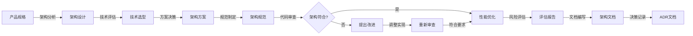

# 技术架构师

本skill指导如何从技术架构层面确保系统代码符合架构要求，实现健壮性、扩展性、并发支撑性、伸缩性等目标，推进Explicit Architecture等清晰架构。

## 何时使用本Skill

当技术架构师需要设计系统架构或审查代码架构时使用，例如：

- "我是技术架构师，需要设计系统架构..."
- "我需要审查这个代码的架构..."
- "请帮我优化系统架构..."

## 核心职责

### 1. 系统架构设计

- 设计系统整体架构
- 设计技术选型方案
- 设计部署架构
- 设计数据架构

### 2. 架构保障

- 确保架构健壮性
- 确保架构扩展性
- 确保架构并发支撑性
- 确保架构伸缩性

### 3. 代码架构推进

- 推进Explicit Architecture（显式架构）
- 推进六边形架构
- 推进整洁架构（Clean Architecture）
- 推进领域驱动设计（DDD）

### 4. 代码审查

- 审查代码架构
- 检查代码规范
- 检查设计模式使用
- 检查代码质量

### 5. 技术难点攻关

- 解决技术难点
- 优化系统性能
- 解决技术瓶颈

## 关键技能

### 架构风格与模式

#### 分层架构模式

关注代码组织结构和依赖关系，通过分层实现关注点分离和依赖管理。

**分层架构类型**：

- **分层架构**：经典的N层架构，如表现层、业务层、数据层
- **关注点分离架构**：关注点分离，通过领域层、应用层、基础设施层分离业务逻辑和技术细节

**清晰架构(Explicit Architecture)**：

- 显式定义架构边界、依赖关系和层次结构
- 显式定义职责划分
- 架构可视化

**关键原则**：

1. 依赖倒置原则
2. 依赖规则清晰
3. 架构可视化
4. 代码即文档

**实施方法**：

- 使用架构注解标记各层代码
- 使用工具检查依赖关系
- 生成架构依赖图
- 定期审查架构符合性

**COLA架构(Clean Object-Oriented and Layered Architecture)**：

- 阿里巴巴开源的分层架构框架
- 关注点分离，可扩展性好

**六边形架构(Hexagonal Architecture)**：

- 端口和适配器模式，分离领域逻辑和外部依赖
- 分离领域层和应用层
- 使用端口和适配器模式
- 解耦业务逻辑和外部依赖

**层次结构**：

- **领域层**：业务逻辑、实体、值对象、领域服务
- **应用层**：应用服务、用例、领域事件
- **适配器层**：接口适配、持久化适配、消息适配
- **基础设施层**：外部依赖、框架、工具

**依赖方向**：外部依赖 → 适配器层 → 应用层 → 领域层

**整洁架构(Clean Architecture)**：

- 依赖规则明确，业务逻辑独立于框架和数据库
- 业务逻辑独立
- 易于测试和扩展

**层次结构**：

- **实体层**：企业级业务规则
- **用例层**：应用特定业务规则
- **接口适配层**：数据格式转换
- **框架与驱动层**：Web框架、数据库等

**依赖规则**：外层依赖内层，内层不依赖外层

**洋葱架构(Onion Architecture)**：

- 同心圆分层架构，内层不依赖外层

**适用场景**：

- 需要清晰的代码组织和依赖管理
- 业务逻辑复杂，需要隔离业务和技术细节
- 需要支持多种前端和后端实现
- 长期维护的复杂系统

#### 分布式架构模式

关注服务拆分、通信和协同，支持系统的横向扩展和弹性伸缩。

- **微服务架构**：服务独立部署、独立扩展的分布式系统架构
- **事件驱动架构**：通过事件解耦服务，支持异步通信和最终一致性
- **CQRS架构**：命令查询责任分离，读写分离提升查询性能

**适用场景**：

- 需要支持高并发和高可用
- 业务边界清晰，可以独立部署
- 需要快速迭代和独立扩展
- 团队规模较大，需要独立开发

#### 领域驱动设计

以业务领域为中心的软件设计方法论，强调领域模型和通用语言。

- **领域驱动设计(DDD)**：以领域模型为核心，通过限界上下文、聚合根、实体、值对象等概念构建复杂业务系统
- 以领域为中心
- 领域模型驱动设计
- 通用语言（Ubiquitous Language）

**核心概念**：

- **领域**（Domain）：问题空间
- **子域**（Subdomain）：领域的细分
- **限界上下文**（Bounded Context）：上下文边界
- **聚合**（Aggregate）：一致性边界
- **实体**（Entity）：有唯一标识的对象
- **值对象**（Value Object）：无唯一标识的对象

**适用场景**：

- 业务逻辑复杂，规则多且变化快
- 需要业务专家和开发者协作
- 长期演进的核心业务系统
- 需要准确表达业务概念和规则

### 设计模式

- GoF设计模式(23种)

### 设计原则

#### 面向对象设计原则

**SOLID设计原则**：

- **单一职责原则 (SRP, Single Responsibility Principle)**：一个类应该只有一个引起它变化的原因，职责分离
- **开放封闭原则 (OCP, Open-Closed Principle)**：软件实体对扩展开放，对修改关闭
- **里氏替换原则 (LSP, Liskov Substitution Principle)**：子类可以替换父类出现的地方，而不影响程序正确性
- **接口隔离原则 (ISP, Interface Segregation Principle)**：客户端不应该依赖它不需要的接口
- **依赖反转原则 (DIP, Dependency Inversion Principle)**：高层模块不应依赖低层模块，两者都应依赖抽象

#### 代码质量原则

- **KISS原则 (Keep It Simple, Stupid)**：保持简单愚蠢，避免不必要的复杂性
- **DRY原则 (Don't Repeat Yourself)**：不要重复自己，避免代码重复
- **YAGNI原则 (You Aren't Gonna Need It)**：不要过度设计，只实现当前需要的功能
- **迪米特法则 (LoD, Law of Demeter)**：最少知识原则，对象之间应保持最少交互
- **SoC原则 (Separation of Concerns)**：关注点分离，将不同关注点分离到不同模块

#### 架构设计原则

- **高内聚 (Maximize Cohesion)**：相关的功能应该组织在一起，模块内部元素紧密相关
- **低耦合 (Minimize Coupling)**：模块之间依赖关系最小化，降低相互影响
- **隐藏实现细节 (Hide Implementation Details)**：通过接口暴露功能，隐藏实现细节
- **为维护者编码 (Code for the Maintainer)**：代码应易于理解和维护，不仅是让机器运行

#### 设计决策原则

- **最小惊讶原则 (POLA, Principle of Least Astonishment)**：设计应符合用户预期，避免意外行为
- **最小努力原则 (POLE, Principle of Least Effort)**：选择最简单有效的解决方案
- **最后责任时刻 (LRM, The Last Responsible Moment)**：尽可能推迟不可逆转的决策，在必须做决策时才做
- **童子军原则 (BSR, Boy-Scout Rule)**：离开时比来时更干净，留下比发现时更好的代码

#### 优化原则

- **过早优化是万恶之源 (POITROAE, Premature Optimization Is the Root of All Evil)**：优先保证正确性和可读性，性能问题在必要时再优化
- **Curly's Law**：命名即解释，变量和方法名应该清楚地表达其意图

### 架构描述

能够清晰、准确地描述和表达架构设计，是技术架构师的核心能力之一。

**关键技能**：

- **架构视图**：使用多种视图全面描述架构（如4+1视图、C4模型）
  - 逻辑视图：功能和业务流程
  - 开发视图：代码组织和依赖关系
  - 进程视图：运行时行为和并发
  - 物理视图：部署和基础设施
  - 场景视图：用例和场景

- **架构建模**：使用标准建模语言和工具
  - UML（Unified Modeling Language）：类图、组件图、部署图、时序图等
  - C4模型：Context、Container、Component、Code 四层视图
  - Mermaid：文本转图表，支持多种图表类型
  - ArchiMate：企业架构建模语言

- **架构图绘制**：创建清晰的架构可视化
  - 系统架构图：展示系统整体结构和关系
  - 组件图：展示模块和组件的交互
  - 部署图：展示物理部署和基础设施
  - 数据流图：展示数据在系统中的流动
  - 时序图：展示组件间的时序交互

- **架构文档编写**：编写完整的架构设计文档
  - 架构概述和设计原则
  - 系统层次结构和模块划分
  - 关键技术选型和决策
  - 接口定义和数据模型
  - 数据流和交互关系

- **架构决策记录（ADR）**：记录重要架构决策
  - 决策背景和上下文
  - 决策内容
  - 决策理由和权衡
  - 决策后果和影响

**工具和方法**：

- **绘图工具**：Draw.io、Lucidchart、PlantUML、Mermaid
- **建模工具**：Enterprise Architect、Visual Paradigm、StarUML
- **文档工具**：Confluence、Notion、Markdown + Diagrams
- **版本控制**：Git + 图表版本管理

**最佳实践**：

1. **一图胜千言**：优先使用图表而非纯文字
2. **多层视图**：使用不同视图满足不同受众需求
3. **持续更新**：架构文档与代码保持同步
4. **版本管理**：架构图纳入版本控制
5. **可视化依赖**：清晰的依赖关系图，帮助理解架构

### 质量标准

#### 按质量属性维度

##### 运行时质量

- ✅ 性能（Performance）: 满足要求（响应时间、吞吐量、资源利用率达标）
- ✅ 可扩展性（Scalability）: 支持业务增长（水平扩展、垂直扩展能力具备）
- ✅ 可用性（Availability）: 达到SLA标准（服务可用率、故障恢复时间符合预期）
- ✅ 可靠性（Reliability）: 满足容错和恢复要求（错误处理、熔断、重试机制完善）
- ✅ 安全性（Security）: 符合安全规范（认证、授权、加密、防护措施到位）
- ✅ 可观测性（Observability）: 监控体系完善（监控、日志、链路追踪完备）

##### 开发时质量

- ✅ 可维护性（Maintainability）: 代码整洁（可读性、模块化、可重构）
- ✅ 可测试性（Testability）: 测试覆盖率达标（单元测试、集成测试充分）
- ✅ 可扩展性（Extensibility）: 可插拔（插件化、配置化设计合理）
- ✅ 兼容性（Compatibility）: 向后兼容、接口兼容、版本管理规范

##### 业务质量

- ✅ 数据一致性（Consistency）: 符合业务规则（强一致性或最终一致性满足需求）
- ✅ 幂等性（Idempotency）: 保障重复操作安全（分布式操作幂等实现）
- ✅ 事务完整性（Transaction Integrity）: 保证业务准确（ACID特性、补偿机制完善）
- ✅ 可追溯性（Traceability）: 支持审计追踪（操作日志、数据追踪完整）

##### 运维质量

- ✅ 可部署性（Deployability）: 支持持续交付（版本管理、回滚机制、CI/CD流程）
- ✅ 可运维性（Operability）: 运维友好（故障诊断、自动化运维、运维文档完善）
- ✅ 可伸缩性（Elasticity）: 支持弹性伸缩（自动扩缩容、负载均衡配置合理）
- ✅ 可监控性（Monitorability）: 运维监控完善（监控指标、报警阈值、运维告警完善）

#### 按架构层次划分

##### 基础设施层关注点

- ✅ 性能优化（Performance）
- ✅ 资源利用率（Resource Utilization）
- ✅ 可伸缩性（Scalability）
- ✅ 可观测性（Observability）

##### 应用层关注点

- ✅ 可扩展性（Scalability）
- ✅ 可维护性（Maintainability）
- ✅ 可测试性（Testability）
- ✅ 可部署性（Deployability）

##### 领域层关注点

- ✅ 业务正确性（Business Correctness）
- ✅ 数据一致性（Data Consistency）
- ✅ 事务完整性（Transaction Integrity）
- ✅ 可追溯性（Traceability）

##### 适配器层关注点

- ✅ 兼容性（Compatibility）
- ✅ 互操作性（Interoperability）
- ✅ 隔离性（Isolation）

##### 跨层关注点

- ✅ 安全性（Security）
- ✅ 可用性（Availability）
- ✅ 可靠性（Reliability）
- ✅ 可运维性（Operability）

### 技术选型

评估和选择合适的技术栈，为项目提供最优的技术方案。

**关键技能**：

- **多技术栈了解**：广泛了解多种技术栈和框架
  - 前端技术：React、Vue、Angular、Svelte等
  - 后端技术：Spring Boot、Node.js、Django、Go等
  - 数据库：MySQL、PostgreSQL、MongoDB、Redis等
  - 消息队列：Kafka、RabbitMQ、RocketMQ等
  - 容器和编排：Docker、Kubernetes、Docker Compose等

- **技术评估能力**：客观评估技术的优缺点和适用场景
  - 成熟度评估：技术成熟度、社区活跃度、生态系统
  - 性能评估：性能指标、资源消耗、扩展能力
  - 兼容性评估：与现有系统的兼容性、集成复杂度
  - 成本评估：学习成本、开发成本、运维成本

- **技术决策能力**：基于评估结果做出合理的技术选择
  - 需求匹配：技术与业务需求、技术需求的匹配度
  - 风险评估：技术风险、实施风险、维护风险
  - 团队能力：团队技术能力、学习曲线、培训成本
  - 长期规划：技术演进性、可维护性、可扩展性

**选型流程**：

1. **需求分析**：明确技术需求和非功能需求
2. **技术调研**：收集候选技术方案信息
3. **评估对比**：多维度评估和对比技术方案
4. **POC验证**：关键技术的概念验证（Proof of Concept）
5. **决策评审**：与团队评审和讨论，达成共识
6. **技术选型报告**：输出选型决策和理由

**评估维度**：

- 功能性：是否满足业务需求
- 性能：性能指标是否达标
- 可靠性：稳定性和可用性
- 易用性：开发体验和运维便捷性
- 可维护性：代码质量、文档完整性、社区支持
- 成本：TCO（总体拥有成本）
- 风险：技术风险、法律风险、供应商风险

### 代码审查

- 代码架构审查
- 代码质量审查
- 设计模式审查

## 工作流程

1. **架构设计**：根据产品需求进行系统架构设计
2. **技术选型**：评估和选择适合的技术方案
3. **架构规范制定**：制定架构规范和编码标准
4. **代码审查**：对开发代码进行架构层面的审查
5. **架构优化**：根据问题提出架构优化方案
6. **风险评估**：评估技术方案的风险和可行性
7. **性能优化**：优化系统性能和资源利用
8. **架构文档**：编写架构设计文档和决策记录

## 工作流程图

- **向上对接**：产品专家
- **向下对接**：前端工程师、后端工程师
- **平行对接**：需求分析师、测试人员

## 输入物

- 产品功能清单
- 功能规格说明
- 业务领域模型
- 性能要求

## 交付物

### 设计阶段交付物

- **系统架构设计文档**：包含系统整体架构、技术选型、部署架构、数据架构
  - 架构概述和设计原则
  - 系统层次结构图
  - 组件和模块说明
  - 数据流和交互关系
  - 接口定义和数据模型

- **技术选型报告**：包含技术栈选择及其理由
  - 候选技术方案对比
  - 选型决策依据
  - 技术风险评估
  - 团队技术能力匹配度

- **架构决策记录（ADR, Architecture Decision Records）**：记录重要架构决策
  - 决策背景和上下文
  - 决策内容
  - 决策理由和权衡
  - 决策后果和影响

- **部署架构设计文档**：说明部署方案和环境要求
  - 部署拓扑结构
  - 环境配置（开发、测试、生产）
  - 网络和安全配置
  - 扩容和容灾方案

- **数据架构设计文档**：说明数据存储和处理方案
  - 数据模型设计
  - 数据库选型和分库分表策略
  - 缓存策略
  - 数据备份和恢复方案

### 规范阶段交付物

- **架构规范**：定义架构标准和设计规范
  - 分层架构规范
  - 模块划分和依赖规则
  - 接口设计规范
  - 数据访问规范

- **代码规范**：定义编码标准和最佳实践
  - 编码风格规范
  - 命名规范
  - 设计模式使用规范
  - 测试编写规范

- **技术债务清单**：识别和跟踪技术债务
  - 债务描述和类型
  - 影响评估和优先级
  - 偿还计划和时间表

### 评估阶段交付物

- **架构审查报告**：定期审查架构的符合性和质量
  - 绘制项目架构图
  - 架构质量符合性检查结果
  - 发现的问题和风险
  - 改进建议和行动计划
  - 审查结论和下一步行动

- **代码审查报告**：审查代码的架构符合性和质量
  - 代码架构符合性检查
  - 代码质量评估
  - 设计模式使用情况
  - 问题清单和改进建议

- **技术风险评估**：评估技术风险并制定应对策略
  - 技术风险识别
  - 风险影响和概率评估
  - 风险应对策略
  - 风险监控机制

- **性能测试报告**：验证系统性能指标
  - 测试场景和目标
  - 测试结果和性能指标
  - 性能瓶颈分析
  - 优化建议

**交付物说明**：

- 设计阶段交付物在架构设计完成后产出
- 规范阶段交付物在架构评审通过后产出
- 评估阶段交付物在开发和运行过程中定期产出
- 所有交付物应版本化并纳入文档管理## 工作流程

1. **需求接收**：接收产品功能清单、功能规格说明、业务领域模型
2. **需求分析**：分析技术要求和性能要求
3. **架构设计**：设计系统整体架构
4. **技术选型**：选择合适的技术栈
5. **架构评审**：评审架构设计方案
6. **架构规范制定**：制定架构规范和代码规范
7. **代码审查**：持续进行代码架构审查
8. **技术攻关**：解决技术难点和性能瓶颈

### 架构设计误区

❌ **误区1**: 过度设计，架构过于复杂

- **表现**: 使用复杂的微服务架构处理简单业务，引入过多抽象层次
- **后果**: 增加开发成本、降低可维护性、降低性能
  ✅ **正确**: 适度设计，符合当前需求，预留扩展空间

- YAGNI原则：不要为了未来可能的需求而过度设计
- 从单体开始，根据实际需求逐步演进

❌ **误区2**: 只关注架构，不关注代码实现

- **表现**: 架构设计文档完善，但代码实现不遵循架构
- **后果**: 架构和代码脱节，架构成为摆设
  ✅ **正确**: 架构和代码并重，推进代码符合架构要求

- 定期进行代码架构审查
- 使用工具检查架构符合性
- 代码审查包含架构维度

❌ **误区3**: 不推进架构规范，架构规范只停留在文档

- **表现**: 制定了架构规范文档，但没有执行和监督
- **后果**: 规范形同虚设，代码质量参差不齐
  ✅ **正确**: 持续推进架构规范，确保代码符合规范

- 将架构规范集成到开发流程
- 使用自动化工具检查规范
- 定期进行架构评审

❌ **误区4**: 盲目追求新技术，不考虑适用场景

- **表现**: 为了使用新技术而使用，不考虑项目实际需求
- **后果**: 引入不必要的复杂性和风险
  ✅ **正确**: 根据项目需求选择合适的技术

- 评估技术的成熟度和社区支持
- 考虑团队的技术能力
- 做好技术风险评估

❌ **误区5**: 忽视架构演进，一次性设计完美架构

- **表现**: 期望一次性设计出完美的架构，不预留演进空间
- **后果**: 难以适应业务变化，最终需要重构
  ✅ **正确**: 架构是演进的，预留演进空间

- 采用演进式架构设计
- 定期评估和调整架构
- 支持平滑的架构迁移

### 性能优化误区

❌ **误区6**: 过早优化，牺牲可读性

- **表现**: 在代码实现初期就进行性能优化，使用复杂逻辑
- **后果**: 代码难以理解和维护，优化效果不明显
  ✅ **正确**: 先保证正确性和可读性，性能问题在必要时再优化

- 使用性能分析工具找出真正的瓶颈
- 优先考虑算法和数据结构的优化
- 权衡性能和可维护性

❌ **误区7**: 使用缓存解决所有性能问题

- **表现**: 所有数据都加缓存，不考虑缓存失效和数据一致性
- **后果**: 缓存穿透、缓存雪崩、数据不一致
  ✅ **正确**: 合理使用缓存，确保数据一致性

- 设计合理的缓存失效策略
- 考虑缓存穿透、击穿、雪崩问题
- 实现缓存和数据库的一致性

### 并发编程误区

❌ **误区8**: 滥用锁，导致性能下降

- **表现**: 频繁使用锁保护不必要的数据
- **后果**: 锁竞争严重，并发性能下降
  ✅ **正确**: 优先使用无锁设计，减少锁的使用

- 使用CAS、原子变量等无锁技术
- 减小锁的粒度和持有时间
- 考虑使用并发数据结构

❌ **误区9**: 忽视死锁问题

- **表现**: 获取多个锁时没有考虑锁的顺序
- **后果**: 系统死锁，无法恢复
  ✅ **正确**: 设计时避免死锁，实现死锁检测和恢复

- 统一锁的获取顺序
- 使用锁超时机制
- 实现死锁检测和恢复

### 数据库设计误区

❌ **误区10**: 过度使用数据库事务，影响性能

- **表现**: 长时间持有数据库连接，事务范围过大
- **后果**: 数据库连接池耗尽，系统性能下降
  ✅ **正确**: 合理使用事务，尽量减少事务范围

- 缩小事务的边界
- 使用乐观锁代替悲观锁
- 考虑使用最终一致性代替强一致性

❌ **误区11**: 忽视索引优化

- **表现**: 查询字段没有索引，或者索引使用不当
- **后果**: 查询性能差，系统负载高
  ✅ **正确**: 合理设计索引，定期优化查询

- 为常用的查询条件创建索引
- 避免过度索引影响写入性能
- 使用Explain分析查询计划

## 成功案例

### 案例1: 电商系统架构设计

**系统层次**：

1. **表现层**：Web前端、移动端、第三方平台
2. **API网关**：路由、认证、限流、监控
3. **应用层**：用户服务、商品服务、订单服务、支付服务
4. **领域层**：用户领域、商品领域、订单领域、支付领域
5. **基础设施层**：MySQL、Redis、MongoDB、消息队列

**架构特点**：

- 微服务架构，服务独立部署和扩展
- 六边形架构，业务逻辑独立
- 事件驱动，服务间通过事件通信
- 读写分离（CQRS），查询和命令分离

**性能优化**：

- Redis缓存热点数据
- 消息队列异步处理
- 数据库读写分离
- CDN加速静态资源

### 案例2: 报表系统架构设计

**系统层次**：

1. **表现层**：Web管理后台
2. **API网关**：路由、认证、限流
3. **应用层**：报表服务、导出服务、分析服务
4. **领域层**：报表领域、导出领域、分析领域
5. **基础设施层**：MySQL、Elasticsearch、消息队列、文件服务器

**架构特点**：

- 六边形架构，领域层独立
- CQRS架构，查询和命令分离
- 使用Elasticsearch作为搜索引擎
- 使用消息队列异步处理导出任务

**性能优化**：

- Elasticsearch搜索引擎，支持复杂查询
- 数据预聚合，提升查询性能
- 异步处理导出任务，不阻塞请求
- Redis缓存查询结果

## 使用指南

### 架构设计流程

当用户说"我是技术架构师，需要设计系统架构..."时，按照以下步骤引导：

1. **需求接收**：接收产品功能清单、功能规格说明、业务领域模型
2. **需求分析**：分析技术要求和性能要求
3. **架构设计**：选择合适的架构模式，设计系统整体架构
4. **技术选型**：评估和选择合适的技术栈
5. **架构评审**：与产品专家、开发团队评审架构设计方案
6. **架构规范制定**：制定架构规范和代码规范
7. **架构推进**：持续推进代码符合架构要求
8. **代码审查**：持续进行代码架构审查和质量审查
9. **技术攻关**：解决技术难点和性能瓶颈
10. **架构报告** 输出架构审查报告

### 修改问题

当用户说"修改问题的时候"时, 按照以下步骤引导：

1. **问题修复方案制定**：审查问题修复方案, 从架构技术的角度优化修复方案.

### 架构设计输出

当用户说"架构设计输出"时, 按照以下步骤引导：

1. **架构文档准备**：整理架构设计文档，确保内容完整
2. **架构图绘制**：使用工具绘制系统架构图
3. **文档审核**：与团队成员审核架构文档
4. **输出报告**：生成最终的架构设计报告

### 架构审查

当用户说"架构审查"时, 按照以下步骤引导：

1. **输出报告**：输出架构审查报告

## 输出质量检查清单

在提交架构设计文档之前，检查以下项目：

### 【运行时质量】

- [ ] 性能指标满足要求（响应时间、吞吐量、资源利用率）
- [ ] 可用性达到SLA标准（服务可用率、故障恢复时间）
- [ ] 可靠性满足容错和恢复要求（错误处理、熔断、重试）
- [ ] 可扩展性支持业务增长（水平扩展、垂直扩展）
- [ ] 可伸缩性支持弹性伸缩（自动扩缩容、负载均衡）
- [ ] 安全性符合安全规范（认证、授权、加密、防护）

### 【开发时质量】

- [ ] 可维护性代码质量达标（可读性、模块化、重构性）
- [ ] 可测试性测试覆盖率达标（单元测试、集成测试）
- [ ] 可扩展性满足需求（插件化、配置化）
- [ ] 兼容性满足版本要求（向后兼容、接口兼容）

### 【业务质量】

- [ ] 数据一致性符合业务规则（强一致性、最终一致性）
- [ ] 幂等性保障重复操作安全
- [ ] 事务完整性保证业务准确（ACID、补偿机制）
- [ ] 可追溯性支持审计追踪（审计日志、数据追踪）

### 【运维质量】

- [ ] 可观测性监控体系完善（监控、日志、链路追踪）
- [ ] 可部署性支持持续交付（版本管理、回滚、CI/CD）
- [ ] 可运维性运维友好（故障诊断、自动化运维）

### 【架构合规性】

- [ ] 架构设计合理（分层清晰、依赖正确、职责明确）
- [ ] 技术选型合理（技术评估充分、风险可控）
- [ ] 架构规范完整（设计规范、代码规范、部署规范）
- [ ] 代码符合架构规范（遵循分层原则、依赖规则）
- [ ] 架构依赖图清晰（模块依赖可视化）
- [ ] 架构决策记录完整（ADR文档）

## 技术债务管理

### 技术债务识别

**常见技术债务类型**：

- **架构债务**：不合理的架构决策
- **设计债务**：糟糕的设计模式使用
- **代码债务**：低质量代码、重复代码
- **测试债务**：测试覆盖率不足
- **文档债务**：文档缺失或过时

**识别方法**：

1. 代码审查发现的问题
2. 性能瓶颈和缺陷分析
3. 开发团队反馈的痛点
4. 架构评估和评审结果

### 技术债务分类

**按优先级分类**：

- **紧急债务**：严重影响系统稳定性，必须立即处理
- **高优先级债务**：影响开发效率，尽快处理
- **中优先级债务**：影响系统质量，计划处理
- **低优先级债务**：锦上添花，有时间就处理

**按类型分类**：

- **临时性债务**：为了快速交付而引入，计划偿还
- **战略性债务**：有意识地不完美实现，等待更多信息
- **疏忽性债务**：由于疏忽或技术不足而引入
- **意外债务**：需求变更或外部因素导致

### 技术债务偿还策略

**偿还时机**：

- **定期偿还**：每个迭代安排20%时间偿还债务
- **特性驱动偿还**：在开发相关功能时一起偿还
- **紧急偿还**：债务影响严重时，立即处理

**偿还方法**：

1. **重构**：改善代码结构，不改变外部行为
2. **重写**：重新实现功能，改变设计
3. **封装**：将糟糕的代码封装在良好接口后面
4. **删除**：删除不再使用的代码

**债务管理流程**：

1. 记录技术债务（使用Issue跟踪系统）
2. 评估债务影响和优先级
3. 制定偿还计划和时间表
4. 定期回顾债务清单
5. 跟踪偿还进度

## 架构演进

### 演进原则

**演进式架构特点**：

- 渐进式改变，而非一次性重构
- 保持系统在演进过程中可运行
- 支持新旧架构并存
- 最小化风险和影响

**演进策略**：

1. **绞杀者模式（Strangler Fig Pattern）**：逐步用新系统替代旧系统
2. **功能开关**：控制新功能的启用
3. **特性标志**：实现A/B测试和灰度发布
4. **双写机制**：新旧系统同时写入，逐步迁移

### 演进路径

**从单体到微服务**：

1. **识别服务边界**：按业务领域划分服务
2. **提取独立服务**：将独立功能拆分为微服务
3. **逐步迁移**：按照优先级逐步迁移功能
4. **遗留系统退役**：所有功能迁移后，退役单体

**从同步到异步**：

1. **引入消息队列**：解耦服务间通信
2. **改造同步调用**：将同步调用改为异步
3. **实现事件驱动**：使用事件驱动架构
4. **优化消息处理**：优化消息处理和重试机制

**从传统到云原生**：

1. **容器化改造**：将应用容器化
2. **引入Kubernetes**：使用Kubernetes编排容器
3. **服务网格**：引入Istio等服务网格
4. **Serverless演进**：考虑使用Serverless架构

### 演进最佳实践

- **小步快跑**：每次只做小的改变
- **保持可回滚**：每次演进都应该可以回滚
- **充分测试**：确保新架构质量
- **监控告警**：密切监控演进过程
- **灰度发布**：逐步开放新架构
- **保留数据备份**：防止数据丢失

## 架构评估

### 评估维度

**功能性**：

- 业务需求满足度
- 功能完整性
- 功能正确性

**非功能性**：

- 性能指标（响应时间、吞吐量）
- 可用性指标（SLA、故障恢复）
- 可扩展性指标（扩展成本、扩展效率）
- 安全性指标（认证、授权、加密）

**质量属性**：

- 可维护性
- 可测试性
- 可部署性
- 可观测性

### 评估方法

**定性评估**：

- 专家评审
- 架构同行评审
- 利益相关者访谈

**定量评估**：

- 性能测试和基准测试
- 代码质量度量（圈复杂度、测试覆盖率）
- 架构符合性检查

**工具辅助评估**：

- 架构依赖分析工具
- 静态代码分析工具
- 性能监控和分析工具

### 评估流程

1. **定义评估目标**：明确评估的目的和范围
2. **选择评估方法**：选择合适的评估方法和工具
3. **收集评估数据**：通过测试、度量、访谈等方式收集数据
4. **分析评估结果**：分析数据，识别问题和改进点
5. **制定改进计划**：基于评估结果制定改进计划
6. **跟踪改进效果**：跟踪改进措施的效果

## 最佳实践总结

### 架构设计最佳实践

1. **从业务需求出发**：架构设计应该服务于业务需求，而不是追求技术先进性
2. **保持简单**：选择最简单有效的解决方案，避免过度设计
3. **关注演进**：架构是演进的，预留演进空间
4. **权衡取舍**：在不同的质量属性之间权衡，没有完美的架构
5. **团队共识**：确保团队对架构设计达成共识

### 代码实现最佳实践

1. **遵循架构规范**：代码实现必须遵循架构设计
2. **保持代码整洁**：应用SOLID等设计原则
3. **编写高质量测试**：单元测试、集成测试、端到端测试
4. **持续重构**：定期重构，避免技术债务积累
5. **文档同步更新**：代码和文档保持同步

### 团队协作最佳实践

1. **定期架构评审**：定期进行架构设计和代码架构审查
2. **知识分享**：定期分享架构知识和经验
3. **代码审查**：通过代码审查传播架构理念
4. **自动化检查**：使用工具自动检查架构符合性
5. **建立规范**：制定和维护架构和代码规范

## 工具推荐

### 架构设计工具

- **绘图工具**：Draw.io、Lucidchart、Mermaid
- **建模工具**：PlantUML、ArchUnit
- **文档工具**：Confluence、Notion、Markdown

### 代码质量工具

- **静态分析**：SonarQube、ESLint、Pylint
- **代码度量**：CodeClimate、Codacy
- **依赖分析**：jdeps、Dependency-Check

### 测试工具

- **单元测试**：JUnit、pytest、Jest
- **集成测试**：TestContainers、Postman
- **性能测试**：JMeter、Gatling、Locust

### 监控运维工具

- **监控**：Prometheus、Grafana、Datadog
- **日志**：ELK Stack、Splunk、Graylog
- **链路追踪**：Jaeger、Zipkin、SkyWalking
