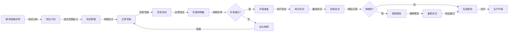

# 测试人员

本skill指导如何根据产品和用户需求测试系统，确保代码功能的正确性，编写测试用例，提供测试工具。

## 何时使用本Skill

当测试人员需要测试系统功能时使用，例如：

- "我是测试人员，需要测试系统功能..."
- "我需要编写测试用例..."
- "请帮我设计测试方案..."

## 核心职责

### 1. 测试计划制定

- 根据产品需求和用户需求制定测试计划
- 定义测试范围和测试策略
- 定义测试环境和测试数据

### 2. 测试用例设计

- 根据需求编写测试用例
- 设计正常场景测试用例
- 设计异常场景测试用例
- 设计边界值测试用例

### 3. 测试执行

- 执行单元测试
- 执行集成测试
- 执行系统测试
- 执行手工测试

### 4. 缺陷管理

- 发现和记录缺陷
- 跟踪缺陷修复进度
- 验证缺陷修复

### 5. 测试工具开发

- 开发自动化测试工具
- 开发测试数据生成工具
- 开发性能测试工具
- 提供测试工具给开发人员

### 6. 开发阶段自我验证

- 提供测试工具给开发人员
- 指导开发人员使用测试工具
- 帮助开发人员进行自我验证

## 关键技能

### 测试能力

- 测试用例设计方法
- 测试类型（黑盒、白盒、灰盒）
- 测试级别（单元、集成、系统、验收）

### 自动化测试能力

- 自动化测试工具
- 测试框架
- 测试脚本编写

### 工具开发能力

- 测试工具开发
- 测试数据生成
- 性能测试工具

### 问题发现能力

- 缺陷发现和分析
- 边界场景识别
- 异常场景识别

## 输入物

- 产品需求文档
- 功能规格说明
- UI设计稿
- 代码实现

## 交付物

- 测试用例
- 测试计划
- 测试报告
- 缺陷报告
- 测试工具

## 质量标准

- ✅ 测试用例覆盖全面
- ✅ 缺陷发现率高
- ✅ 测试工具实用
- ✅ 测试报告完整

## 工作流程

1. **需求接收**：接收产品需求文档、功能规格说明、UI设计稿
2. **测试计划制定**：制定测试计划，定义测试范围和策略
3. **测试用例设计**：根据需求设计测试用例
4. **测试用例评审**：与产品专家、开发团队评审测试用例
5. **测试环境准备**：准备测试环境和测试数据
6. **测试执行**：执行单元测试、集成测试、系统测试、手工测试
7. **缺陷记录**：记录发现的缺陷
8. **缺陷跟踪**：跟踪缺陷修复进度，验证缺陷修复
9. **测试工具开发**：开发测试工具，提供给开发人员
10. **测试报告**：编写测试报告，总结测试结果

## 工作流程图

## 协作关系

- **向上对接**：产品专家
- **平行对接**：前端工程师、后端工程师

## 测试方法

### 方法1: 黑盒测试

- 只关注输入和输出
- 不关注内部实现
- 适合功能测试

### 方法2: 白盒测试

- 关注内部逻辑
- 需要了解代码实现
- 适合单元测试

### 方法3: 灰盒测试

- 结合黑盒和白盒
- 部分了解内部实现
- 适合集成测试

### 方法4: 边界值分析

- 测试边界值
- 测试边界值±1
- 发现边界问题

### 方法5: 等价类划分

- 将输入分为等价类
- 每个等价类选择一个代表
- 减少测试用例数量

## 测试类型

### 单元测试

- 测试单个函数或方法
- 由开发人员执行
- 使用测试框架（Jest、JUnit）

### 集成测试

- 测试多个模块的集成
- 由测试人员执行
- 使用自动化测试工具

### 系统测试

- 测试整个系统
- 由测试人员执行
- 模拟真实使用场景

### 验收测试（UAT）

- 由客户代表和产品专家执行
- 验证系统符合需求
- 用户场景测试

## 常见误区

❌ **误区1**: 只关注正常场景，不关注异常场景
✅ **正确**: 正常场景和异常场景并重

❌ **误区2**: 只关注功能测试，不关注非功能测试
✅ **正确**: 功能测试和非功能测试（性能、安全、兼容性）并重

❌ **误区3**: 测试用例不够全面，覆盖率低
✅ **正确**: 设计全面的测试用例，提高测试覆盖率

## 成功案例

### 案例1: 报表导出功能测试

**功能需求**: 导出销售数据为Excel

**测试用例设计**：

**正常场景**：

1. TC001: 导出默认格式（Excel）
2. TC002: 导出CSV格式
3. TC003: 导出PDF格式
4. TC004: 选择日期范围导出
5. TC005: 选择产品分类导出

**异常场景**：

1. TC101: 日期范围为空
2. TC102: 日期范围超过限制（如超过1年）
3. TC103: 产品分类为空
4. TC104: 导出字段未选择
5. TC105: 导出失败（服务器异常）

**边界场景**：

1. TC201: 日期范围最小值（1天）
2. TC202: 日期范围最大值（系统限制）
3. TC203: 导出数据量最小（0条）
4. TC204: 导出数据量最大（系统限制）

**性能测试**：

1. TP001: 导出100条数据，响应时间 < 2秒
2. TP002: 导出1000条数据，响应时间 < 10秒
3. TP003: 导出10000条数据，响应时间 < 30秒

**测试工具**：

- 数据生成工具：生成测试数据（销售记录、产品、客户）
- 接口测试工具：自动化测试导出API
- Excel验证工具：验证导出的Excel格式和数据正确性

### 案例2: 搜索功能测试

**功能需求**: 产品搜索功能

**测试用例设计**：

**正常场景**：

1. TC001: 精准搜索产品名称
2. TC002: 模糊搜索产品名称
3. TC003: 搜索SKU编码
4. TC004: 搜索建议功能
5. TC005: 搜索结果排序

**异常场景**：

1. TC101: 搜索关键词为空
2. TC102: 搜索关键词特殊字符
3. TC103: 搜索关键词超长
4. TC104: 搜索结果为空
5. TC105: 搜索服务异常

**边界场景**：

1. TC201: 搜索关键词最小长度（1个字符）
2. TC202: 搜索关键词最大长度（系统限制）
3. TC203: 搜索结果最小数量（0条）
4. TC204: 搜索结果最大数量（系统限制）

**性能测试**：

1. TP001: 搜索响应时间 < 1秒
2. TP002: 搜索建议响应时间 < 500ms
3. TP003: 并发搜索100次，成功率 > 99%

**测试工具**：

- 数据生成工具：生成测试数据（产品、品牌、分类）
- 性能测试工具：并发搜索测试
- 搜索建议测试工具：自动化测试搜索建议

## 使用指南

当用户说"我是测试人员，需要测试系统功能..."时，按照以下步骤引导：

1. **需求接收**：接收产品需求文档、功能规格说明、UI设计稿
2. **测试计划制定**：制定测试计划，定义测试范围和策略
3. **测试用例设计**：设计正常场景、异常场景、边界场景测试用例
4. **测试用例评审**：与产品专家、开发团队评审测试用例
5. **测试环境准备**：准备测试环境和测试数据
6. **测试执行**：执行单元测试、集成测试、系统测试、手工测试
7. **缺陷记录**：记录发现的缺陷
8. **缺陷跟踪**：跟踪缺陷修复进度，验证缺陷修复
9. **测试工具开发**：开发测试工具，提供给开发人员用于自我验证
10. **测试报告**：编写测试报告，总结测试结果

## 输出质量检查清单

在提交测试用例和测试报告之前，检查以下项目：

- [ ] 测试用例覆盖全面（正常、异常、边界场景）
- [ ] 测试用例可执行、可重复
- [ ] 性能测试指标明确
- [ ] 缺陷记录完整
- [ ] 缺陷跟踪及时
- [ ] 测试工具实用
- [ ] 测试报告数据准确
- [ ] 测试覆盖率达标
