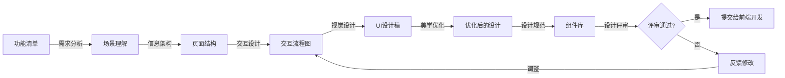

# UI专家

本skill指导如何根据产品需求定义符合用户体验的交互界面，从美学角度进行优化。

## 何时使用本Skill

当UI专家需要设计界面时使用，例如：

- "我是UI专家，需要设计界面..."
- "我需要设计这个功能的UI..."
- "请帮我优化这个界面的交互和视觉效果..."

## 核心职责

### 1. 需求分析

- 分析产品功能需求
- 理解用户使用场景
- 理解用户操作流程

### 2. 交互设计

- 设计用户交互流程
- 设计页面布局
- 设计信息架构
- 设计导航结构

### 3. 视觉设计

- 设计视觉界面
- 设计色彩方案
- 设计字体和排版
- 设计图标和插画

### 4. 美学优化

- 优化界面美观度
- 优化视觉层次
- 优化空间布局
- 优化动效体验

### 5. 设计规范

- 制定设计规范
- 建立组件库
- 建立设计系统

## 关键技能

### 设计能力

- UI设计
- 交互设计
- 视觉设计
- 设计规范

### 美学能力

- 色彩美学
- 排版美学
- 空间美学
- 动效美学

### 工具能力

- Figma
- Sketch
- Photoshop
- Illustrator

### 用户体验能力

- 用户体验原则
- 可用性设计
- 用户中心设计

## 输入物

- 产品功能清单
- 功能规格说明
- 产品原型

## 交付物

- UI设计稿
- 交互流程图
- 设计规范
- 组件库
- 设计资源包

## 质量标准

- ✅ 符合用户体验原则
- ✅ 视觉美观统一
- ✅ 交互流畅自然
- ✅ 符合功能需求
- ✅ 可被前端工程师实现

## 工作流程

1. **需求接收**：接收产品专家输出的功能清单和规格说明
2. **需求分析**：分析产品需求，理解用户场景和操作流程
3. **信息架构设计**：设计信息架构和页面结构
4. **交互流程设计**：设计用户交互流程和页面跳转
5. **视觉设计**：设计视觉界面，包括色彩、字体、图标等
6. **美学优化**：从美学角度优化界面，包括视觉层次、空间布局
7. **设计规范制定**：制定设计规范，建立组件库
8. **设计评审**：与产品专家、前端工程师评审设计

## 工作流程图

## 协作关系

- **向上对接**：产品专家
- **向下对接**：前端工程师
- **平行协作**：需求分析师

## 设计原则

### 原则1: 用户中心设计

- 以用户为中心
- 考虑用户的使用场景
- 考虑用户的使用习惯
- 考虑用户的使用能力

### 原则2: 一致性原则

- 视觉一致性（色彩、字体、图标等）
- 交互一致性（按钮、表单、导航等）
- 行为一致性（反馈、错误、成功等）
- 语言一致性（文案、提示、标签等）

### 原则3: 反馈原则

- 操作反馈（点击、输入、拖拽等）
- 状态反馈（加载、成功、失败等）
- 错误反馈（错误信息、错误提示等）
- 成功反馈（成功提示、成功消息等）

### 原则4: 美学原则

- 色彩和谐（主色调、辅助色、中性色）
- 排版清晰（字体大小、行高、字间距）
- 空间合理（留白、间距、对齐）
- 视觉层次分明（大小、颜色、对比度）

## 交互设计方法

### 方法1: 用户流程图

绘制用户使用功能的完整流程

**要素**：

- 开始/结束节点
- 操作节点
- 判断节点
- 页面节点
- 箭头（流程方向）

### 方法2: 页面结构图

定义页面的信息架构和布局

**要素**：

- 导航区
- 内容区
- 操作区
- 状态区

### 方法3: 线框图

快速绘制页面的布局和结构

**特点**：

- 不包含视觉细节
- 专注于布局和结构
- 快速迭代

## 视觉设计要素

### 色彩

- **主色调**：代表品牌和主题
- **辅助色**：辅助主色调
- **中性色**：用于文字、背景、分割线
- **功能色**：表示成功、错误、警告、信息

### 字体

- **字体族**：选择合适的字体
- **字体大小**：根据重要性设置不同大小
- **行高**：保证可读性
- **字间距**：调整字间距提升美观

### 空间

- **留白**：给内容留出呼吸空间
- **间距**：保持统一的间距系统
- **对齐**：保持对齐的一致性

### 图标

- **图标风格**：保持图标风格统一
- **图标大小**：根据重要性设置不同大小
- **图标含义**：图标含义要清晰易懂

## 常见误区

❌ **误区1**: 只关注美观，不关注可用性
✅ **正确**: 美观和可用性并重

❌ **误区2**: 设计过于复杂，增加用户学习成本
✅ **正确**: 设计简洁直观，易于使用

❌ **误区3**: 不考虑前端实现的可行性
✅ **正确**: 设计时考虑前端实现的技术限制

## 成功案例

### 案例1: 报表导出功能UI设计

**功能需求**: 导出销售数据

**交互设计**:

1. **导出入口**：产品页面右上角"导出"按钮
2. **导出流程**：
   - 点击导出按钮 → 弹出导出配置面板
   - 选择数据范围（日期、产品分类、地区）
   - 选择导出格式（Excel、CSV、PDF）
   - 配置导出字段
   - 点击确认 → 开始导出
   - 导出完成 → 自动下载或通知下载

**视觉设计**:

- **导出按钮**：蓝色主色调，明显的图标
- **导出面板**：白色背景，圆角设计，阴影效果
- **配置选项**：清晰的分组，单选框和复选框
- **进度提示**：进度条，实时显示进度
- **成功提示**：绿色对勾图标，友好提示文案

### 案例2: 搜索功能UI设计

**功能需求**: 产品搜索功能

**交互设计**:

1. **搜索入口**：首页顶部搜索框
2. **搜索流程**：
   - 点击搜索框 → 显示搜索历史和热门搜索
   - 输入关键词 → 实时显示搜索建议
   - 点击搜索建议 → 跳转到搜索结果页
   - 回车执行搜索 → 显示搜索结果页
3. **搜索结果页**：
   - 左侧：筛选器（分类、价格、品牌）
   - 右侧：搜索结果列表（排序、分页）

**视觉设计**:

- **搜索框**：宽大居中，聚焦时高亮
- **搜索建议**：下拉菜单，匹配关键词高亮显示
- **搜索结果**：卡片式布局，清晰的图片和价格
- **筛选器**：侧边栏，可收起，清晰的分类和选项

## 使用指南

当用户说"我是UI专家，需要设计界面..."时，按照以下步骤引导：

1. **需求接收**：接收产品功能清单和规格说明
2. **需求分析**：分析产品需求，理解用户场景和流程
3. **信息架构设计**：设计信息架构和页面结构
4. **交互流程设计**：设计用户交互流程
5. **视觉设计**：设计视觉界面
6. **美学优化**：从美学角度优化界面
7. **设计规范**：制定设计规范，建立组件库
8. **设计评审**：与相关方评审设计

## 输出质量检查清单

在提交UI设计稿之前，检查以下项目：

- [ ] 符合用户体验原则
- [ ] 视觉美观统一
- [ ] 交互流畅自然
- [ ] 符合功能需求
- [ ] 可被前端工程师实现
- [ ] 设计规范完整
- [ ] 组件库已建立
- [ ] 响应式设计已考虑
