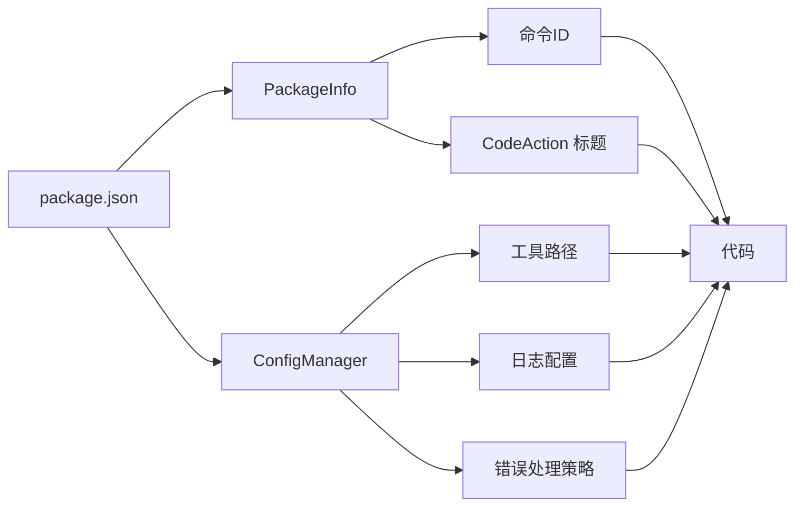
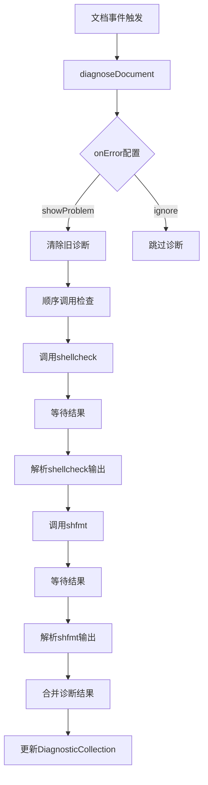
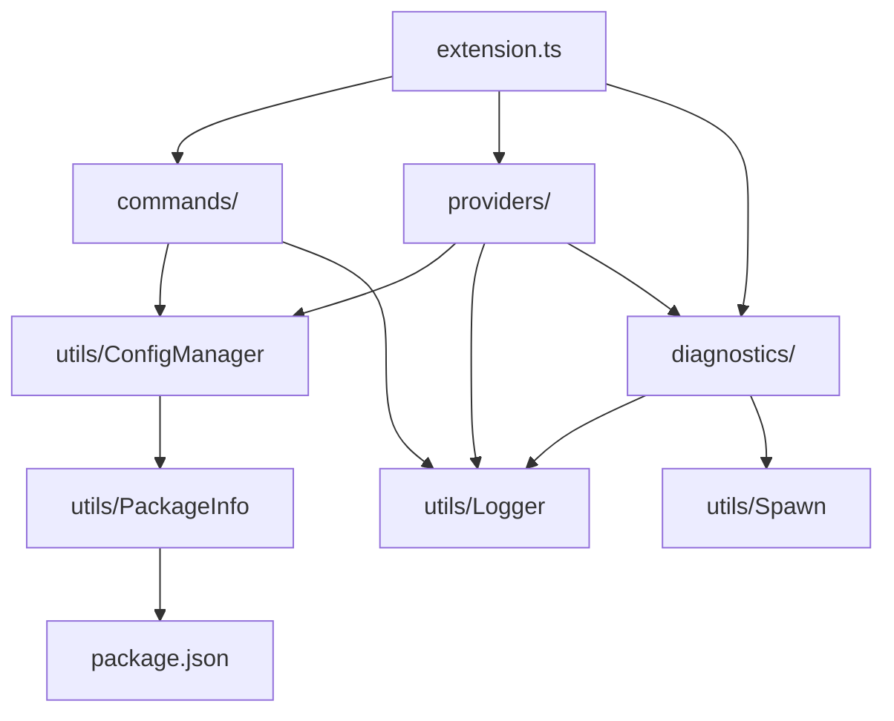
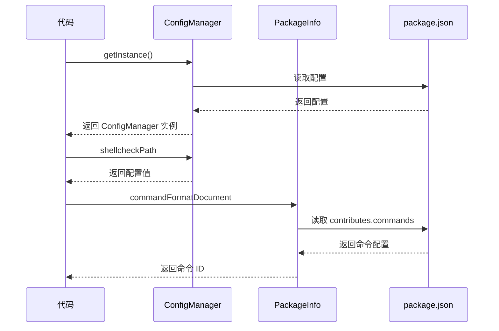
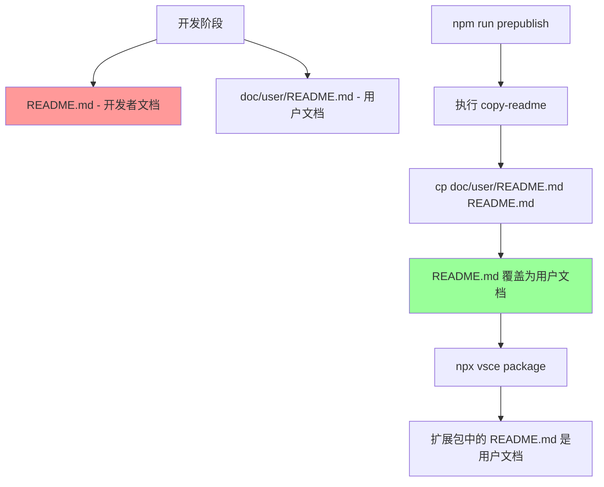

# Shell Format

> 基于 shfmt 和 shellcheck 的 VSCode Shell 脚本格式化和诊断扩展

## 项目简介

Shell Format 是一个 VSCode 扩展，提供 Shell 脚本的格式化和错误诊断功能。它使用 shfmt 进行格式化，使用 shellcheck 进行语法和语义检查。

### 核心特性

- **配置驱动设计** - 所有配置从 `package.json` 统一管理
- **模板化扩展入口** - `extension.ts` 提供标准化的激活/停用流程
- **顺序诊断流程** - 先执行 shellcheck，后执行 shfmt
- **完整工具链** - 包含格式化、诊断、CodeAction、日志记录

### 技术栈

- **语言**: TypeScript
- **运行时**: Node.js
- **依赖工具**: shfmt, shellcheck
- **API**: VSCode Extension API

## 快速开始

### 环境要求

- Node.js >= 18
- VSCode >= 1.74.0
- shfmt (必需)
- shellcheck (推荐)

### 安装依赖

```bash
npm install
```

### 开发

#### 编译

```bash
npx tsc -p ./
```

#### 监听模式

```bash
npx tsc -watch -p ./
```

#### 代码检查

```bash
npx eslint src --ext ts
```

#### 测试

```bash
npx node ./out/test/runTest.js
```

### 打包

```bash
npx vsce package
```

打包时 `doc/user/README.md` 会被复制为根目录的 `README.md`，作为插件市场首页。

### 本地安装

#### 方式1 ：通过界面安装

1. 右键单击生成的.vsix文件
2. 选择 "安装扩展VSIX"

#### 方式2 ：通过命令安装

```shell
code  --install-extension shell-format.vsix --extension-dir ~/.vscode/extensions
```

#### 安装结果检查

有多种方式可以检查扩展是否安装成功：

1. 打开扩展市场，筛选设置"已安装", 搜索 "shell-format"
2. 执行命令code --list-extensions | grep shell-format
3. 执行命令ll ~/.vscode/extensions/ | grep shell-format

### 发布到市场

检查没问题后, 可以发布到市场, 前提是要有自己的账号.

 1. 登录VSCode Marketplace, 地址是 <https://marketplace.visualstudio.com/>
 2. 点击右上角的"发布者"按钮, 进入发布者页面
 3. 点击 "新建" 按钮
 4. 填写相关信息
 5. 上传vsix文件
 6. 填写描述信息
 7. 填写标签
 8. 填写图标
 9. 填写截图
 10. 填写预览图片
 11. 填写预览视频
 12. 点击 "发布" 按钮

## 项目结构

```tree
shell_format/
├── src/                                    # 源代码目录
│   ├── extension.ts                        # 扩展入口（模板化实现）
│   ├── commands/                           # 命令处理
│   │   ├── index.ts                        # 命令注册入口
│   │   ├── formatCommand.ts                # 格式化文档命令
│   │   └── fixCommand.ts                   # 修复所有问题命令
│   ├── diagnostics/                        # 诊断相关
│   │   ├── index.ts                        # 诊断管理器
│   │   ├── shellcheck.ts                   # shellcheck 诊断
│   │   └── shfmt.ts                        # shfmt 格式检查
│   ├── formatters/                         # 格式化器
│   │   └── documentFormatter.ts            # 文档格式化器
│   ├── providers/                          # 提供者
│   │   └── codeActionProvider.ts          # CodeAction 提供者
│   └── utils/                              # 工具类
│       ├── extensionInfo.ts                # 扩展信息工具
│       ├── logger.ts                       # 日志工具
│       ├── messages.ts                     # 消息提示
│       ├── shell.ts                        # Shell 命令日志
│       └── spawnErrorHandler.ts            # spawn 错误处理
├── doc/                                    # 文档目录
│
├── test/                                   # 测试目录
├── dist/                                   # 编译输出目录 [打包: ✅]
├── package.json                            # 扩展配置
├── tsconfig.json                           # TypeScript 配置
├── .vscodeignore                           # 打包排除文件
└── README.md                               # 开发者文档（当前文件）[打包: ❌]
```

### doc目录

**功能**: 用于放置项目除根目录readme.md之外的所有文档
**目录下文件详细介绍**: [doc/INDEX.md](./doc/INDEX.md)

### 模块职责说明

| 模块 | 职责 | 关键功能 |
|-----|------|---------|
| `extension.ts` | 扩展入口 | 激活/停用、注册提供者、监听事件 |
| `commands/` | 命令处理 | 格式化命令、修复命令 |
| `diagnostics/` | 诊断管理 | shellcheck/shfmt 检查、诊断集合管理 |
| `formatters/` | 格式化器 | 执行 shfmt 格式化、处理格式化结果 |
| `providers/` | 提供者 | CodeAction 快速修复 |
| `utils/` | 工具类 | 配置管理、日志、进程执行、错误处理 |

doc目录下文档详细介绍,请查看 ：[doc/INDEX.md](doc/INDEX.md)

## 核心设计

### 1. extension.ts 模板化实现

`extension.ts` 作为 VSCode 扩展的标准入口模板，统一处理：

- **初始化顺序** - 日志 → 配置 → 命令 → 提供者 → 事件
- **资源清理** - 一次性对象订阅管理
- **事件处理** - 文档事件监听
- **生命周期管理** - activate/deactivate 对称设计

```typescript
export async function activate(context: vscode.ExtensionContext) {
    // 1. 初始化日志系统
    const logger = Logger.getInstance();

    // 2. 初始化配置管理器（从 package.json 读取）
    const configManager = ConfigManager.getInstance();

    // 3. 注册格式化命令
    const formatCommand = new FormatCommand(logger, configManager);
    formatCommand.register(context);

    // 4. 注册修复命令
    const fixCommand = new FixCommand(logger, configManager);
    fixCommand.register(context);

    // 5. 注册诊断提供者
    const diagnosticProvider = new DiagnosticProvider(logger, configManager);
    diagnosticProvider.register(context);

    // 6. 注册 CodeAction 提供者
    const codeActionProvider = new CodeActionProvider(logger, configManager);
    codeActionProvider.register(context);

    logger.info('Extension activated successfully');
}

export function deactivate() {}
```

### 2. 配置驱动设计

所有配置（路径、参数、命令ID等）从 `package.json` 统一管理：



| 工具类 | 职责 | 读取的配置 |
|-------|------|-----------|
| `PackageInfo` | 命令 ID、CodeAction 标题 | `contributes.commands`, `contributes.codeActions` |
| `ConfigManager` | 工具路径、日志、错误处理 | `contributes.configuration` |

**错误写法（硬编码）**:

```typescript
const commandId = 'shell-format.formatDocument';  // ❌ 硬编码
```

**正确写法（从配置读取）**:

```typescript
const commandId = PackageInfo.commandFormatDocument;  // ✅ 从 package.json 读取
```

### 3. 诊断实现

顺序调用 shellcheck 和 shfmt 进行诊断：



代码实现:

```typescript
// 步骤1: 使用 shellcheck 检查
const shellcheckErrors = await checkWithShellcheck(document);
allDiagnostics.push(...shellcheckErrors);

// 步骤2: 使用 shfmt 检查
const formatErrors = await checkFormat(document);
allDiagnostics.push(...formatErrors);

// 更新诊断集合
if (allDiagnostics.length > 0) {
    diagnosticCollection.set(document.uri, allDiagnostics);
}
```

### 4. 模块依赖关系



### 5. 配置流序列图



## 开发指南

### 添加新命令

1. 在 `src/commands/` 创建命令类
2. 从 `package.json` 读取命令配置
3. 在 `extension.ts` 注册

### 添加新配置

1. 在 `package.json` 的 `contributes.configuration` 添加配置项
2. 在 `ConfigManager` 添加访问方法
3. 在代码中使用 `ConfigManager.getInstance()` 访问配置

### 修改诊断逻辑

诊断逻辑在 `src/diagnostics/` 目录：

- `index.ts` - 诊断管理器
- `shellcheck.ts` - shellcheck 诊断实现
- `shfmt.ts` - shfmt 格式检查实现

## 文档

### 用户文档

- [用户使用文档](doc/user/README.md) - 插件功能、配置和使用说明

### 开发者文档

完整文档索引: [文档索引](doc/INDEX.md)

| 文档 | 说明 |
|-----|------|
| [快速开始指南](doc/developer/getting-started.md) | 开发环境配置 |
| [架构设计文档](doc/developer/architecture.md) | 架构设计说明 |
| [package.json 配置](doc/configuration/package-json.md) | 扩展配置详解 |

### 工具文档

| 文档 | 说明 |
|-----|------|
| [shellcheck 使用指南](doc/tools/shellcheck.md) | shellcheck 工具说明 |
| [shfmt 使用指南](doc/tools/shfmt.md) | shfmt 工具说明 |
| [spawn 使用指南](doc/tools/spawn.md) | Node.js spawn API 使用 |

## 打包说明

### 打包配置

`.vscodeignore` 控制哪些文件被打包：

| 目录/文件 | 打包状态 | 说明 |
|----------|---------|------|
| `dist/` | ✅ | 编译输出，必须打包 |
| `doc/user/` | ✅ | 用户文档 |
| `doc/tools/` | ✅ | 工具文档 |
| `doc/developer/` | ❌ | 开发者文档 |
| `doc/configuration/` | ❌ | 配置文档 |
| `doc/packaging/` | ❌ | 打包文档 |
| `doc/INDEX.md` | ❌ | 文档索引 |
| `src/` | ❌ | 源代码 |
| `test/` | ❌ | 测试代码 |
| `node_modules/` | ❌ | 依赖包 |
| `README.md` | ❌ | 开发者文档 |

### 打包流程



## 许可证

MIT License - 详见 [LICENSE](LICENSE)

## 致谢

感谢以下开源工具：

- [shfmt](https://github.com/mvdan/sh) - Shell 脚本格式化工具
- [shellcheck](https://github.com/koalaman/shellcheck) - Shell 脚本静态分析工具
