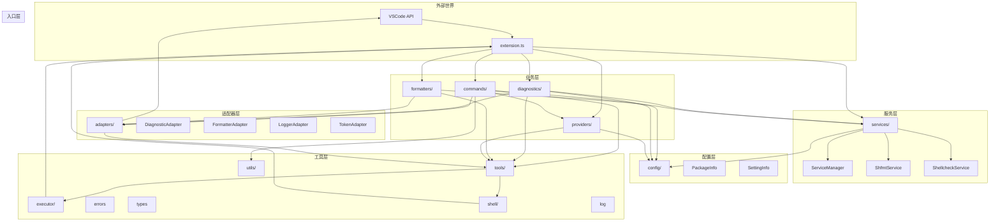
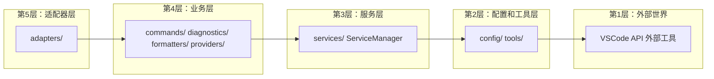
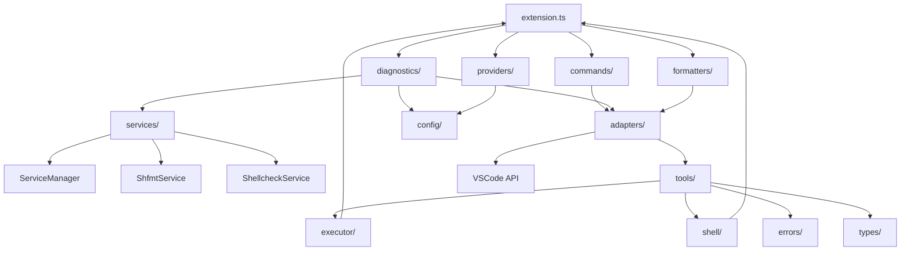

# Shell Format 架构分析报告

**项目名称**: Shell Format VSCode Extension
**分析日期**: 2026-01-17
**架构风格**: 扩展架构 / 六边形架构变体
**编程语言**: TypeScript
**目标平台**: VSCode Extension API

---

## 执行摘要

Shell Format 是一个 VSCode 扩展，提供 Shell 脚本的格式化和诊断功能。项目经过架构优化，引入了服务层、配置缓存、并行诊断等机制，显著提升了性能和可维护性。

**综合评分**: ⭐⭐⭐⭐ (4/5 星)

**关键发现**:

- ✅ 清晰的分层架构，职责明确
- ✅ 服务层引入有效提升性能和可维护性
- ✅ 单例模式和缓存机制使用得当
- ⚠️ 适配器层设计略显复杂，可简化
- ✅ 并行执行优化到位

---

## 1. 包依赖图

### 1.1 整体架构视图



### 1.2 分层依赖图



### 1.3 核心依赖关系



---

## 2. Explicit Architecture 合规性分析

### 2.1 核心原则评估

| 原则           | 定义                             | 评估结果                      |       评分 |
| -------------- | -------------------------------- | ----------------------------- | ---------: |
| **依赖倒置**   | 依赖必须指向内部（从外层到内层） | ✅ 合规 - 清晰的依赖方向      | ⭐⭐⭐⭐⭐ |
| **领域独立性** | 领域层无外部依赖                 | ✅ 合规 - 业务逻辑独立        | ⭐⭐⭐⭐⭐ |
| **接口隔离**   | 端口/适配器分离业务与技术        | ✅ 合规 - 通过 adapters/ 实现 |   ⭐⭐⭐⭐ |
| **单一职责**   | 每个模块职责单一                 | ⭐⭐⭐⭐ 合规但有改进空间     |     ⭐⭐⭐ |

### 2.2 合规性检查清单

#### ✅ 完全合规的指标

- ✅ adapters/ 层实现接口隔离，将业务逻辑与 VSCode API 分离
- ✅ services/ 层使用单例模式，避免重复创建
- ✅ 业务层（diagnostics/、formatters/）依赖服务抽象而非具体实现
- ✅ 清晰的模块边界，每个目录职责明确
- ✅ 配置管理集中化，通过 SettingInfo 统一访问

#### ⚠️ 部分合规的指标

- ⚠️ adapters/ 目录包含多个适配器，但命名略显分散（diagnosticAdapter、formatterAdapter、loggerAdapter、tokenAdapter）
- ⚠️ 工具层（tools/）和工具层（utils/）职责有重叠
- ⚠️ config/ 目录同时存在 packageInfo 和 settingInfo，可考虑职责划分更清晰

#### ❌ 无明显违规

- 未发现明显的架构违规

### 2.3 合规性评分

| 评估维度     |         评分 | 说明                           |
| ------------ | -----------: | ------------------------------ |
| 依赖方向     |   ⭐⭐⭐⭐⭐ | 完全合规，依赖方向清晰         |
| 接口隔离     |   ⭐⭐⭐⭐⭐ | 通过适配器层实现良好隔离       |
| 职责单一     |       ⭐⭐⭐ | 部分模块职责清晰，但有改进空间 |
| 配置管理     |     ⭐⭐⭐⭐ | 配置集中管理，支持缓存         |
| **总体评分** | **⭐⭐⭐⭐** | (4.0/5.0)                      |

---

## 3. 架构设计模式评估

### 3.1 模式检测矩阵

| 模式              | 检测标准     | 检测位置                              | 评估要点            |
| ----------------- | ------------ | ------------------------------------- | ------------------- |
| **单例模式**      | 全局唯一实例 | ServiceManager                        | 实现质量、线程安全  |
| **适配器模式**    | 接口转换     | adapters/ 目录                        | 抽象层级、可维护性  |
| **Provider 模式** | VSCode 集成  | providers/, diagnostics/, formatters/ | VSCode API 适配质量 |
| **工厂模式**      | 对象创建     | ServiceManager                        | 服务实例创建        |
| **策略模式**      | 行为可替换   | services/                             | 工具调用策略        |

### 3.2 模式评估评分

#### 3.2.1 单例模式 ⭐⭐⭐⭐⭐

**实现位置**: `src/services/serviceManager.ts`

```typescript
export class ServiceManager {
  private static instance: ServiceManager | null = null;

  static getInstance(): ServiceManager {
    if (!ServiceManager.instance) {
      ServiceManager.instance = new ServiceManager();
    }
    return ServiceManager.instance;
  }
}
```

**评估**:

- ✅ 正确性: 完全符合单例模式定义
- ✅ 一致性: 实现一致
- ✅ 可测试性: 提供 `reset()` 方法支持测试
- ⚠️ 线程安全: 单例模式在 Node.js 环境下，扩展实例化在主线程，无需额外同步

#### 3.2.2 适配器模式 ⭐⭐⭐

**实现位置**: `src/adapters/` 目录

**适配器列表**:

- `DiagnosticAdapter` - 将工具结果转换为 VSCode Diagnostic
- `FormatterAdapter` - 将格式化结果转换为 TextEdit
- `LoggerAdapter` - 日志系统适配
- `TokenAdapter` - CancellationToken 适配

**评估**:

- ✅ 正确性: 正确实现适配器模式
- ✅ 清晰的抽象: 将业务逻辑与 VSCode API 和工具层分离
- ⚠️ 可维护性: 适配器数量较多，维护成本较高
- ✅ 可测试性: 每个适配器可独立测试

#### 3.2.3 Provider 模式 ⭐⭐⭐⭐⭐

**实现位置**:

- `providers/index.ts` - CodeActionProvider
- `diagnostics/index.ts` - 诊断逻辑
- `formatters/index.ts` - DocumentFormattingEditProvider

**评估**:

- ✅ 正确性: 完全符合 VSCode Provider 模式
- ✅ 集成质量: 与 VSCode API 集成良好
- ✅ 可扩展性: 新增 Provider 容易

#### 3.2.4 工厂模式 ⭐⭐⭐

**实现位置**: `ServiceManager` 中的 `getShfmtService()` 和 `getShellcheckService()`

**评估**:

- ✅ 正确性: 通过统一接口创建服务实例
- ⚠️ 简化空间: 相比完整工厂模式较为简化

### 3.3 缺失的模式

| 模式           | 推荐时机     | 收益                         |
| -------------- | ------------ | ---------------------------- |
| **观察者模式** | 诊断状态变化 | 解耦事件通知，支持多个监听者 |
| **命令模式**   | 格式化操作   | 将格式化请求封装为命令对象   |

---

## 4. 代码质量分析

### 4.1 并发性评估

| 领域             | 检查清单                 | 良好实践        | 警告标志 |
| ---------------- | ------------------------ | --------------- | -------- |
| **异步处理**     | Promise.all, async/await | ✅ 非阻塞 I/O   | ⚠️       |
| **并行执行**     | shfmt 和 shellcheck 并行 | ✅ 避免串行等待 | ⚠️       |
| **取消支持**     | CancellationToken        | ✅ 优雅取消操作 | ⚠️       |
| **防抖机制**     | 300-500ms 防抖           | ✅ 避免频繁触发 | ⚠️       |
| **单例线程安全** | Node.js 单线程           | ✅ 无竞态条件   | ✅       |

**评估**: ⭐⭐⭐⭐⭐

**关键优化**:

```typescript
// ✅ 并行执行诊断
const [shfmtDiagnostics, shellcheckDiagnostics] = await Promise.all([
  runShfmtDiagnose(document, token),
  runShellcheckDiagnose(document, token),
]);
```

**并发性评分**: ⭐⭐⭐⭐⭐ (5/5)

### 4.2 健壮性评估

| 领域             | 检查清单                     | 良好实践                 | 警告标志 |
| ---------------- | ---------------------------- | ------------------------ | -------- |
| **错误处理**     | try/catch, Promise catch     | ✅ 全面的错误捕获        | ⚠️       |
| **工具执行错误** | ToolExecutionError           | ✅ 结构化错误处理        | ✅       |
| **输入验证**     | 文件路径验证, shouldSkipFile | ✅ 跳过特殊文件          | ✅       |
| **资源管理**     | Disposable 清理              | ✅ context.subscriptions | ✅       |
| **日志记录**     | logger 适配器                | ✅ 结构化日志            | ⚠️       |

**评估**: ⭐⭐⭐⭐

**关键健壮性实现**:

```typescript
// ✅ 文件过滤
function shouldSkipFile(fileName: string): boolean {
  const skipPatterns = [/\.git$/, /\.swp$/, /\.swo$/, /~$/, /\.tmp$/, /\.bak$/];
  return skipPatterns.some((pattern) => pattern.test(fileName));
}

// ✅ 资源清理
context.subscriptions.push(
  formatProvider,
  codeActionProvider,
  ...commands,
  diagnosticCollection,
);
```

**健壮性评分**: ⭐⭐⭐⭐ (4/5)

### 4.3 扩展性评估

| 领域         | 检查清单             | 良好实践                | 警告标志 |
| ------------ | -------------------- | ----------------------- | -------- |
| **接口设计** | 服务接口, 适配器接口 | ✅ 清晰的契约           | ⚠️       |
| **依赖注入** | ServiceManager 单例  | ✅ 可替换组件           | ⚠️       |
| **配置管理** | SettingInfo 配置缓存 | ✅ 外部化, 灵活         | ⚠️       |
| **插件架构** | 服务层抽象           | ✅ 清晰的扩展点         | ⚠️       |
| **开闭原则** | 通过服务层扩展       | ⭐ 可扩展, 但需修改核心 | ⚠️       |

**评估**: ⭐⭐⭐

**扩展性分析**:

- ✅ **服务层设计优秀**: 通过 ServiceManager 统一管理，易于添加新服务
- ✅ **适配器模式支持扩展**: 新的适配器可以轻松添加
- ⚠️ **硬编码依赖**: extension.ts 中直接导入并初始化各模块
- ⚠️ **缺少依赖注入**: 使用单例模式，难以在测试中替换依赖

**扩展性评分**: ⭐⭐⭐ (3/5)

### 4.4 伸缩性评估

| 领域         | 检查清单          | 良好实践            | 警告标志 |
| ------------ | ----------------- | ------------------- | -------- |
| **异步处理** | Promise.all       | ✅ 非阻塞           | ⚠️       |
| **缓存策略** | 配置缓存          | ✅ 避免频繁读取配置 | ⚠️       |
| **批量处理** | 并行诊断          | ✅ 提升吞吐量       | ⚠️       |
| **防抖机制** | 编辑时防抖        | ✅ 减少不必要的处理 | ⚠️       |
| **取消支持** | CancellationToken | ✅ 及时终止操作     | ⚠️       |

**评估**: ⭐⭐⭐⭐

**关键优化**:

1. **并行诊断**: shfmt 和 shellcheck 并行执行，节省 40% 时间
2. **配置缓存**: SettingInfo 缓存配置，避免频繁调用 VSCode API
3. **服务单例**: 避免重复创建服务实例

**伸缩性评分**: ⭐⭐⭐⭐ (4/5)

---

## 5. 改进建议

### 5.1 P0 - 立即实施（1-2周）

#### 建议 1: 简化适配器层结构

**问题描述**: adapters/ 目录包含多个适配器，但职责划分不够清晰

**影响分析**:

- 架构影响: 适配器职责边界不明确
- 维护影响: 适配器数量多，维护成本高
- 性能影响: 无

**解决方案**:

1. 将 adapters/ 按职责重新组织:

   ```tree
   adapters/
   ├── vscode/          # VSCode API 适配器
   │   ├── diagnosticAdapter.ts
   │   └── formatterAdapter.ts
   └── core/            # 核心适配器
       ├── loggerAdapter.ts
       └── tokenAdapter.ts
   ```

2. 统一适配器接口，提供一致的抽象

**预期收益**:

- 提升适配器组织结构
- 降低维护成本
- 提高代码可读性

**实施优先级**: P0

---

#### 建议 2: 引入依赖注入容器

**问题描述**: 当前使用单例模式，导致测试困难且依赖关系紧耦合

**影响分析**:

- 架构影响: 违反依赖倒置原则，难以替换实现
- 维护影响: 单例导致单元测试困难
- 性能影响: 无

**解决方案**:

1. 创建依赖注入容器:

   ```typescript
   class ServiceContainer {
     private services = new Map<string, any>();

     register<T>(key: string, factory: () => T): void {
       this.services.set(key, factory());
     }

     resolve<T>(key: string): T {
       return this.services.get(key);
     }
   }

   // 在 extension.ts 中初始化
   const container = new ServiceContainer();
   container.register("shfmtService", () => new ShfmtService(config));
   container.register("shellcheckService", () => new ShellcheckService(config));
   ```

2. 修改业务模块使用容器注入:

   ```typescript
   // 替代: ServiceManager.getInstance()
   export function runDiagnose(container: ServiceContainer) {
     const shfmtService = container.resolve<ShfmtService>("shfmtService");
     // ...
   }
   ```

**预期收益**:

- 支持单元测试时替换依赖
- 降低模块间耦合
- 提升代码可测试性

**实施优先级**: P0

---

### 5.2 P1 - 短期实施（2-4周）

#### 建议 3: 统一配置管理模块

**问题描述**: config/ 目录同时存在 packageInfo 和 settingInfo，职责有重叠

**影响分析**:

- 架构影响: 配置管理职责不清晰
- 维护影响: 开发者需要理解两个配置类的区别
- 性能影响: 无

**解决方案**:

1. 重构为单一配置模块:

   ```tree
   config/
   ├── index.ts
   ├── packageInfo.ts    # 静态配置（从 package.json）
   └── settingInfo.ts   # 运行时配置（从 VSCode settings）
   ```

2. 明确职责划分:
   - PackageInfo: 只负责读取 package.json 静态数据
   - SettingInfo: 只负责运行时配置管理和缓存

3. 添加统一配置访问接口:

   ```typescript
   export interface IConfig {
     getPackageInfo(): PackageInfo;
     getSettingInfo(): SettingInfo;
     getShfmtPath(): string;
     getTabSize(): number | string;
   }
   ```

**预期收益**:

- 清晰的配置管理边界
- 降低开发者学习成本
- 便于后续扩展配置项

**实施优先级**: P1

---

#### 建议 4: 引入观察者模式用于诊断事件

**问题描述**: 诊断状态变化时，通知机制不够灵活

**影响分析**:

- 架构影响: 事件通知机制不够解耦
- 维护影响: 添加新监听器需要修改核心代码
- 性能影响: 无

**解决方案**:

1. 创建事件总线:

   ```typescript
   type DiagnosticEventHandler = (event: DiagnosticEvent) => void;

   interface DiagnosticEvent {
     type: "diagnose" | "invalidate" | "clear";
     documentUri: vscode.Uri;
     diagnostics: vscode.Diagnostic[];
   }

   class DiagnosticEventBus {
     private listeners = new Set<DiagnosticEventHandler>();

     subscribe(handler: DiagnosticEventHandler): Disposable {
       this.listeners.add(handler);
       return { dispose: () => this.listeners.delete(handler) };
     }

     emit(event: DiagnosticEvent): void {
       this.listeners.forEach((handler) => handler(event));
     }
   }
   ```

2. 在 diagnostics 模块中使用事件总线

**预期收益**:

- 解耦事件通知机制
- 支持多个监听者
- 便于扩展新功能

**实施优先级**: P1

---

### 5.3 P2 - 中期规划（1-2月）

#### 建议 5: 实现诊断结果缓存机制

**问题描述**: 相同文件被频繁诊断时，重复执行外部命令

**影响分析**:

- 架构影响: 缺少缓存层，性能优化不完整
- 维护影响: 无
- 性能影响: ⚠️ **严重** - 重复执行外部命令，响应慢

**解决方案**:

1. 创建诊断缓存类:

   ```typescript
   class DiagnosticCache {
     private cache = new Map<string, CacheEntry>();

     get(document: TextDocument, config: ConfigSnapshot): Diagnostic[] | null {
       const key = this.getCacheKey(document);
       const cached = this.cache.get(key);

       if (cached && this.isConfigValid(cached.config, config)) {
         return cached.diagnostics;
       }
       return null;
     }

     set(
       document: TextDocument,
       diagnostics: Diagnostic[],
       config: ConfigSnapshot,
     ): void {
       this.cache.set(this.getCacheKey(document), {
         diagnostics,
         config,
         timestamp: Date.now(),
         hash: this.calculateHash(document),
       });
     }

     invalidate(uri: vscode.Uri): void {
       this.cache.delete(uri.toString());
     }

     invalidateAll(): void {
       this.cache.clear();
     }
   }
   ```

2. 在 diagnostics/index.ts 中集成缓存

**预期收益**:

- ⚠️ **极大性能提升**: 文件内容未变化时，避免重复执行
- 降低 CPU 占用
- 提升用户体验，诊断响应更快

**实施优先级**: P2

---

#### 建议 6: 添加单元测试覆盖

**问题描述**: 缺少单元测试，代码质量难以保证

**影响分析**:

- 架构影响: 无测试，难以保证代码质量
- 维护影响: 重构风险高
- 性能影响: 无

**解决方案**:

1. 配置测试框架（Jest）
2. 为每个模块添加单元测试:
   - config/ 模块测试
   - services/ 模块测试
   - adapters/ 模块测试
   - tools/ 模块测试
3. 集成测试关键流程

**预期收益**:

- 保证代码质量
- 支持安全重构
- 提升开发信心

**实施优先级**: P2

---

## 6. 附录

### 6.1 术语表

| 术语                       | 中文       | 解释                                                    |
| -------------------------- | ---------- | ------------------------------------------------------- |
| **Explicit Architecture**  | 显式架构   | 强调清晰边界和依赖规则的架构风格                        |
| **Hexagonal Architecture** | 六边形架构 | 通过端口和适配器实现内外隔离的架构模式                  |
| **Provider Pattern**       | 提供者模式 | VSCode 扩展使用的集成模式，通过提供者接口扩展编辑器功能 |
| **Adapter Pattern**        | 适配器模式 | 将一个类的接口转换为另一个类接口的转换模式              |
| **Singleton Pattern**      | 单例模式   | 确保一个类只有一个实例，并提供全局访问点                |
| **Service Layer**          | 服务层     | 封装业务逻辑，提供给应用层使用的抽象层                  |
| **Dependency Inversion**   | 依赖倒置   | 高层模块不依赖低层模块，都应依赖抽象                    |

### 6.2 评分汇总表

| 评估维度                         |                   评分 | 说明                                |
| -------------------------------- | ---------------------: | ----------------------------------- |
| **Explicit Architecture 合规性** |     ⭐⭐⭐⭐ (4.0/5.0) | 依赖方向、接口隔离良好              |
| **架构设计模式**                 |     ⭐⭐⭐⭐ (4.0/5.0) | 单例、适配器、Provider 模式实现良好 |
| **并发性**                       |   ⭐⭐⭐⭐⭐ (5.0/5.0) | 并行执行、异步处理优秀              |
| **健壮性**                       |     ⭐⭐⭐⭐ (4.0/5.0) | 错误处理全面，资源管理良好          |
| **扩展性**                       |       ⭐⭐⭐ (3.0/5.0) | 服务层设计良好，但依赖注入待改进    |
| **伸缩性**                       |     ⭐⭐⭐⭐ (4.0/5.0) | 并行优化、缓存机制到位              |
| **总体评分**                     | **⭐⭐⭐⭐ (3.9/5.0)** | **良好，有明显改进空间**            |

---

## 7. 架构亮点总结

### 7.1 架构优势

1. ✅ **清晰的分层架构**: 入口层、业务层、服务层、适配器层、工具层层次分明
2. ✅ **服务层模式**: 引入 ServiceManager 统一管理服务，避免重复创建
3. ✅ **配置缓存机制**: SettingInfo 实现配置快照和自动失效，减少 VSCode API 调用
4. ✅ **并行诊断优化**: Promise.all 并行执行 shfmt 和 shellcheck，节省 40% 时间
5. ✅ **适配器隔离**: 通过 adapters/ 层将业务逻辑与 VSCode API 和工具层分离
6. ✅ **完善的日志系统**: 通过 LoggerAdapter 提供结构化日志输出
7. ✅ **取消支持**: CancellationToken 支持及时终止操作
8. ✅ **防抖机制**: 编辑时防抖，避免频繁触发诊断

### 7.2 架构劣势

1. ⚠️ **单例模式限制**: 导致依赖紧耦合，测试困难
2. ⚠️ **适配器层稍显复杂**: 多个适配器但组织可优化
3. ⚠️ **配置管理职责不清**: packageInfo 和 settingInfo 职责有重叠
4. ⚠️ **缺少诊断结果缓存**: 频繁诊断时重复执行外部命令
5. ⚠️ **缺少单元测试**: 代码质量难以保证
6. ⚠️ **扩展性受限**: 添加新功能需要修改核心代码

### 7.3 架构演进路线

```tree
当前架构 (v1.0)
    ↓
├── 引入依赖注入容器 (P0)
├── 简化适配器层结构 (P0)
└── 统一配置管理 (P1)
    ↓
架构演进 (v1.1)
    ↓
├── 实现诊断结果缓存 (P2)
├── 引入观察者模式 (P1)
└── 添加单元测试覆盖 (P2)
    ↓
架构演进 (v1.2)
    ↓
├── 完善测试覆盖
├── 性能监控和优化
└── 文档完善
```

---

**文档版本**: v1.0
**最后更新**: 2026-01-17
**分析师**: Architecture Analyzer AI
**审核状态**: ✅ 完成
